# 🚀 STM32 Register Programming Guide

> **Hướng dẫn lập trình STM32 ở mức thanh ghi (Register Level)**

## 📖 Cách học hiệu quả

🎯 **Bước 01:** Config toàn bộ lại thanh ghi  
🎯 **Bước 02:** Cần dùng gì thì tìm hiểu cái đó

## 📚 Mục lục

| 📂 **CHƯƠNG** | 📝 **NỘI DUNG** | 🔍 **MÔ TẢ** |
|:-------------:|:---------------:|:-------------|
| **00** | GIỚI THIỆU | Kiến thức cơ bản về thanh ghi |
| **01** | TÀI LIỆU | Phần mềm và tài liệu tham khảo |
| **02** | MEMORY | Memory map và địa chỉ |
| **03** | RCC | Reset và Clock Control |
| **04** | GPIO | General Purpose Input/Output |
| **05** | AFIO | Alternate Function I/O |
| **06** | EXTI | External Interrupt |
| **07** | TIMER | Timer/Counter |
| **08** | ADC | Analog to Digital Converter |
| **09** | UART | Universal Asynchronous Receiver/Transmitter |
| **10** | SPI | Serial Peripheral Interface |
| **11** | I2C | Inter-Integrated Circuit |
| **12** | USB | Universal Serial Bus |
| **13** | USB-CDC | USB Communication Device Class |
| **14** | Linker | Linker Script |
| **15** | Startup | Startup Code |
| **16** | MakeFile | Build System |

---

## 🏁 Chương 00: Kiến thức cơ bản về thanh ghi

### 🔧 Các kiến trúc vi điều khiển phổ biến

| 🏷️ **Loại** | 🔧 **Vi điều khiển** | 📊 **Đặc điểm** |
|:----------:|:------------------:|:---------------|
| **ARM** | STM32 | Core ARM Cortex-M3/M4 |
| **8051** | AT89S52 | Kiến trúc 8-bit cổ điển |
| **AVR** | ATMEGA | Atmel AVR RISC |
| **PIC** | PIC8, PIC32 | Microchip PIC |
| **RISC** | ESP32 | Dual core RISC-V |

> 💡 **STM32** sử dụng **ARM Cortex-M3** core với hiệu năng cao và tiêu thụ điện năng thấp

### ⚡ Thao tác bit cơ bản

#### 🔸 Set bit lên 1

**Nguyên tắc:** `Anything OR 1 = 1`

```c
register |= (1 << 3);  // 🎯 Đặt bit thứ 3 lên 1
```

#### 🔹 Clear bit xuống 0

**Nguyên tắc:** `Anything AND 0 = 0`

```c
register &= ~(1 << 3);  // 🎯 Đặt bit thứ 3 về 0
```

### 🏗️ Union - Quản lý bit hiệu quả

> **Ưu điểm:**
>
> - ✅ Tiết kiệm bộ nhớ  
> - ✅ Dễ dàng quản lý từng bit

**Ví dụ:**

```c
typedef union {
    uint8_t REG;          // 📊 Truy cập toàn bộ 8 bit
    struct {
        uint8_t BIT0: 1;  // 🔸 Bit 0
        uint8_t BIT1: 1;  // 🔸 Bit 1
        uint8_t BIT2: 1;  // 🔸 Bit 2
        uint8_t BIT3: 1;  // 🔸 Bit 3
        uint8_t BIT4: 1;  // 🔸 Bit 4
        uint8_t BIT5: 1;  // 🔸 Bit 5
        uint8_t BIT6: 1;  // 🔸 Bit 6
        uint8_t BIT7: 1;  // 🔸 Bit 7
    } BITS;
} __BIT8;

__BIT8 myData;
```

> 💡 **Cơ chế Union:** Khi thay đổi bất kỳ BIT nào, biến REG cũng sẽ thay đổi vì cả REG và BITS đều trỏ đến cùng vùng nhớ.

### 🎯 Định nghĩa con trỏ đến địa chỉ cụ thể

**Ví dụ:** GPIOA có địa chỉ `0x12345678` với kiểu dữ liệu `GPIO_Typedef`

```c
#define GPIOA     ((volatile GPIO_TypeDef*) 0x12345678)
```

### 🔒 Từ khóa `volatile`

> ⚠️ **Quan trọng:** Khi làm việc với phần cứng hoặc tài nguyên có thể thay đổi ngoài tầm kiểm soát của chương trình (như thanh ghi vi điều khiển), compiler có thể tối ưu hóa sai.

**`volatile`** báo hiệu cho compiler:

- 🚫 Không tối ưu hóa biến này
- 🔄 Biến có thể thay đổi bất cứ lúc nào  
- 📖 Luôn đọc giá trị từ memory thay vì cache

---

## 📚 Chương 01: Tài liệu và kiến thức cơ bản

### 💻 Phần mềm cần thiết

| 🛠️ **Công cụ** | 🔗 **Link tải** | 📝 **Mô tả** |
|:-------------:|:-------------:|:-------------|
| **Keil µVision5** | [Download](https://www.keil.com/download/) | IDE chính thức cho ARM |
| **STM32CubeMX** | [Download](https://www.st.com/en/development-tools/stm32cubemx.html) | Code generator |
| **STM32CubeIDE** | [Download](https://www.st.com/en/development-tools/stm32cubeide.html) | IDE miễn phí từ ST |

### 📖 Tài liệu tham khảo

| 📄 **Tài liệu** | 🔗 **Link** | 🎯 **Mục đích** |
|:-------------:|:----------:|:-------------|
| **Datasheet STM32F1** | [PDF](https://www.st.com/resource/en/datasheet/cd00161566.pdf) | Thông số kỹ thuật |
| **Reference Manual** | [PDF](https://www.st.com/resource/en/reference_manual/rm0008-stm32f101xx-stm32f102xx-stm32f103xx-stm32f105xx-and-stm32f107xx-advanced-armbased-32bit-mcus-stmicroelectronics.pdf) | Chi tiết thanh ghi |

### 🔧 Phần cứng

#### 🎯 STM32F103C8T6 Development Board

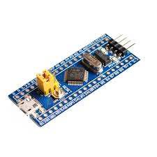

**Đặc điểm:**

- 🚀 ARM Cortex-M3 72MHz
- 💾 64KB Flash, 20KB RAM  
- 🔌 37 GPIO pins
- 💰 Giá rẻ, phổ biến

#### 🔌 ST-Link V2 Programmer

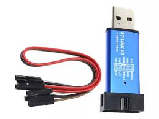

**Chức năng:**

- 📥 Upload code
- 🐛 Debug real-time
- ⚡ SWD interface

---

## 🗺️ Chương 02: Memory Mapping

### 🗺️ Memory Map tổng quan

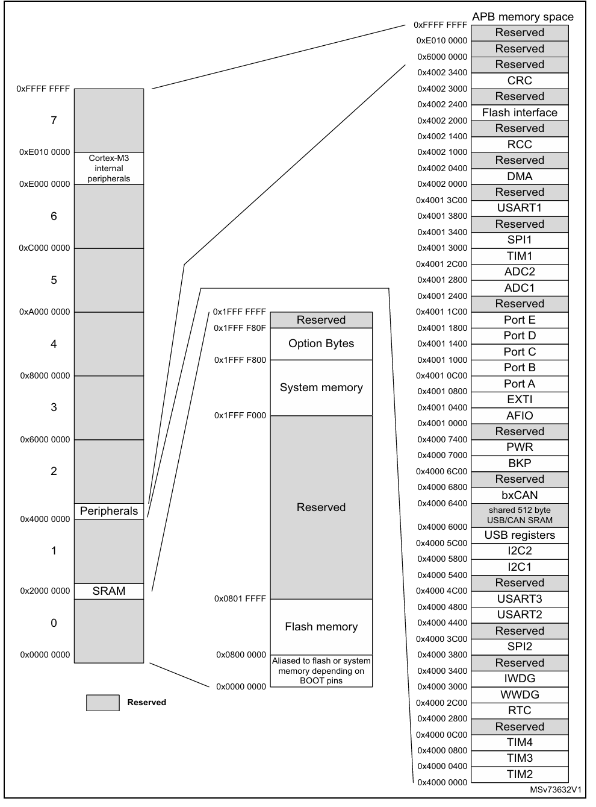

> **STM32F103** có kiến trúc von Neumann với không gian địa chỉ 32-bit (4GB)

### 📍 Địa chỉ Base và Offset

**Nguyên tắc tính toán:**

```c
Địa chỉ thực tế = Địa chỉ Base + Địa chỉ Offset
```

#### 🎯 Ví dụ minh họa

**Base Address:**
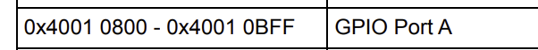

**Address Offset:**


#### 💡 Ví dụ thực tế: Thanh ghi CRH của GPIOA

```c
// 📍 GPIOA Base Address: 0x40010800
// 📍 CRH Offset:         0x04
// ➡️  Địa chỉ CRH:        0x40010800 + 0x04 = 0x40010804

#define GPIOA_BASE    0x40010800
#define CRH_OFFSET    0x04
#define GPIOA_CRH     (GPIOA_BASE + CRH_OFFSET)  // 0x40010804
```

---

## 💡 Thử nghiệm: Blink LED với thanh ghi cơ bản

```c
#include <stdint.h>

//----------🔧 RCC (Reset and Clock Control)-----------------------------
#define RCC_ADD_BASE      0x40021000UL                    // 📍 RCC Base Address  
#define RCC_ADD_APB2ENR   (RCC_ADD_BASE + 0x18)          // 📍 APB2 Peripheral Clock Enable
#define APB2ENR           (*((volatile uint32_t*)RCC_ADD_APB2ENR))

//----------🔌 GPIO (General Purpose I/O)----------------------------
#define GPIOA_ADD_BASE    0x40010800UL                    // 📍 GPIOA Base Address
#define GPIOA_ADD_CRH     (GPIOA_ADD_BASE + 0x04)        // 📍 Port Config Register High  
#define GPIOA_ADD_ODR     (GPIOA_ADD_BASE + 0x0C)        // 📍 Output Data Register
#define GPIOACRH          (*((volatile uint32_t*)GPIOA_ADD_CRH))
#define GPIOODR           (*((volatile uint32_t*)GPIOA_ADD_ODR))

// ⏰ Delay Function
void mDelay(volatile uint32_t time) {
    while(time--);  // 🔄 Simple blocking delay
}

int main() {
    // 🚀 Step 1: Enable GPIOA Clock
    APB2ENR = 0x00000004;              // 🔛 Enable GPIOA clock (bit 2)
    
    // ⚙️  Step 2: Configure PA8 as Output Push-Pull  
    GPIOACRH = 0x00000003;             // 🔧 50MHz Output Push-Pull mode
    
    // 🔁 Main Loop: Blink LED
    while(1) {
        GPIOODR |= (1 << 8);           // 💡 Turn ON LED (PA8 = HIGH)
        mDelay(1000000);               // ⏳ Delay ~1s
        
        GPIOODR &= ~(1 << 8);          // 💤 Turn OFF LED (PA8 = LOW)  
        mDelay(1000000);               // ⏳ Delay ~1s
    }
}
```

---

## ⚡ Chương 03: RCC (Reset and Clock Control)

### 🎯 **Mục tiêu chương này:**

- 🚀 Đưa clock lên tối đa **72MHz**
- 🔛 Bật clock cho các **GPIO peripherals**  
- ⚙️  Hiểu cách cấu hình **clock tree**

### 📖 **1. Giới thiệu về Clock System**

> 🔋 **Clock** là "nhịp tim" của vi điều khiển - không có clock thì không có peripheral nào hoạt động được!

#### ⚠️ **Lưu ý quan trọng về tần số:**

| 🔧 **Loại thạch anh** | ⚡ **Tần số tối đa** | 📝 **Ghi chú** |
|:---------------------|:------------------:|:---------------|
| 🌐 **Thạch anh ngoài (HSE)** | **72MHz** | Độ chính xác cao, ổn định |
| 🏠 **Thạch anh trong (HSI)** | **64MHz** | Tiện lợi, không cần linh kiện ngoài |
| 🔄 **Mặc định** | **8MHz** | HSI không qua PLL |

### 🚀 **2. Cấu hình SystemClock lên 72MHz**

#### 📊 **Sơ đồ Clock Tree:**

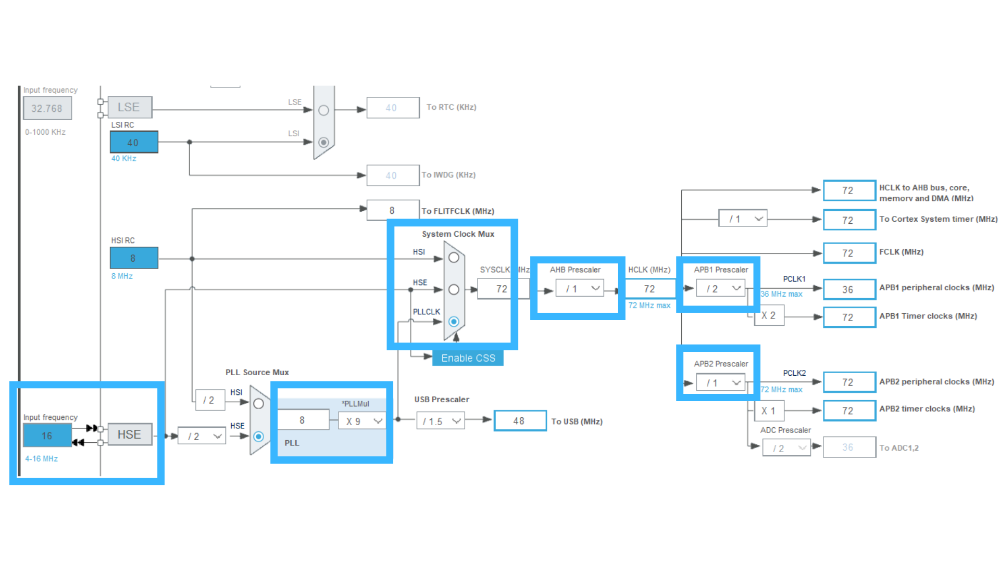

#### 🛠️ **Các bước cấu hình:**

```text
🔹 Bước 01: Enable HSE (High Speed External)
🔹 Bước 02: Config Flash Wait States  
🔹 Bước 03: PLL Multiplier x9 (8MHz x 9 = 72MHz)
🔹 Bước 04: Phân chia clock cho bus
🔹 Bước 05: Chọn PLL làm System Clock
```

### 🔧 **3. Các thanh ghi cấu hình SystemClock**

#### 🎁 Thanh ghi CR

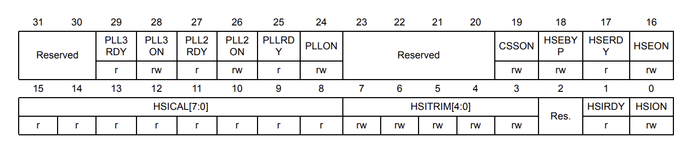

```c
bit 16: Cấu hình system hoạt động theo HSE
bit 17: Đợi cho HSE hoạt dộng
bit 24: Cấu hình theo PLL
bit 25: Đợi cho PLL hoạt động
```

#### 🎁 Thanh ghi CFGR

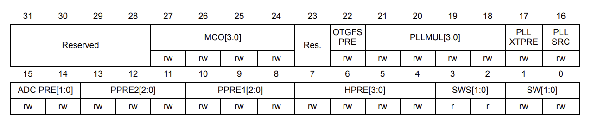

```c
PLLSRC: Chọn src cho PLL
PLLMUL[3:0]: Bộ nhân tần
PPRE2[2:0] : Bộ chia tần APB2
PPRE1[2:0] : Bộ chia tần APB1
HPRE[3:0]  : Bộ chia tần HPRE
SW: Chọn clock cho system
SWS: Chờ cho quá trình SW hoàn thành
```

⚠️⚠️⚠️ Lưu ý: Nếu bạn chỉ làm điều này thì sau khi làm xong thì system của bạn vẫn không thể lên được 72Mhz

Bản thân trong vi điều khiên có một khái niệm flash
Khi bạn chọn SYSCLK chạy ở 72 MHz, điều này ảnh hưởng đến tốc độ của nhiều thành phần trong hệ thống, bao gồm tốc độ truy xuất bộ nhớ Flash
--> Chính vì vậy chúng ta cần config trong 1 thanh ghi nữa về FLASH (FLASH_ACR)

#### 🎁 Thanh ghi FLASH_ACR

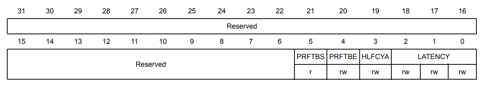

```c
Bits 2:0 LATENCY: Latency
000 Zero wait state, if 0 <= SYSCLK <= 24 MHz
001 One wait state, if 24 MHz < SYSCLK <= 48 MHz
010 Two wait states, if 48 MHz < SYSCLK <= 72 MHz
```

### 4. Bật clock của các ngoại vi

#### APB2

Ví dụ các bạn cần bật Clock của GPIOA thì cần đến thanh ghi này
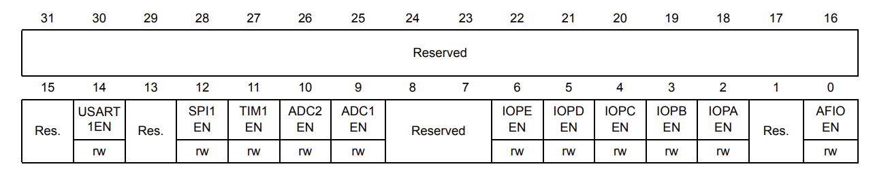
Đơn giản chỉ cần bật bit IOPA = 1 là được

## Chương 04: GPIO

😒 Mục tiêu:

- Xác thực tính đúng đắn của RCC
- Blink Led

GPIO bản chất là vào ra tín hiệu
Để blink led, đầu tiên chúng ta cần chọn ra một chân cắm vào led VD PA0 và thực hiện các lệnh sau

```c
Bước 01: Bật clk của PORTA (RCC bài trước)
Bước 02: Config Output, Input, PullUp, PullDown, PushPull, OpenDrain
Bước 03: Xuất tín hiệu điện áp mức HIGH, LOW để blink led
```

### 1 Một vài thanh ghi

#### 1.1 🎁 Thanh ghi CRL

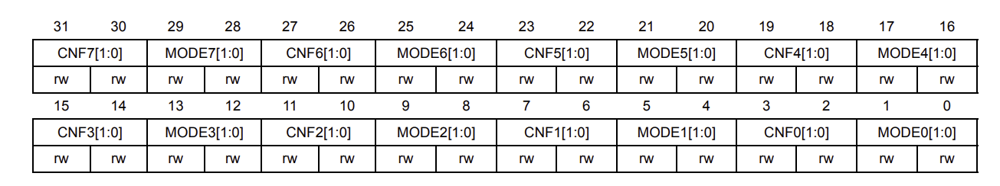

Thanh ghi CRL dùng để cấu hình IO, các Mode cho các Pin từ 0 đến 7

#### 1.2 🎁 Thanh ghi CRH

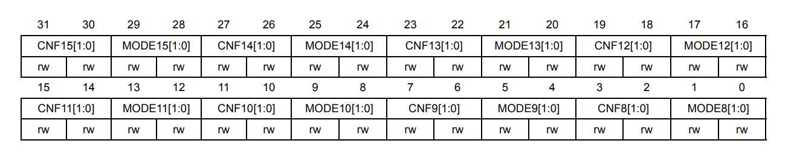

Thanh ghi CRH dùng để cấu hình IO, các Mode cho các Pin từ 8 đến 15

#### 1.3 🎁 Thanh ghi ODR

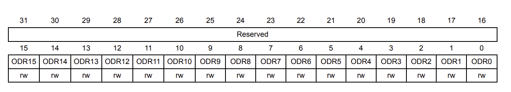

Thanh ghi dùng để xuất tín hiệu ra chân Pin

---

## 🔌 Chương 04: GPIO (General Purpose Input/Output)

### 🎯 **Mục tiêu chương GPIO:**

- 🔧 Hiểu cách cấu hình GPIO modes
- 📝 Thành thạo thanh ghi CRL, CRH, ODR, IDR  
- ⚡ Tạo driver GPIO hoàn chỉnh

### 📖 **1. Giới thiệu GPIO**

> 🔌 **GPIO** là những chân đa năng có thể cấu hình làm input hoặc output với nhiều chế độ khác nhau.

#### 🛠️ **Các chế độ GPIO:**

| 🏷️ **Mode** | 📝 **Mô tả** | 🔧 **Ứng dụng** |
|:----------:|:-------------|:---------------|
| **Input Floating** | Trở kháng cao | Đọc tín hiệu digital |
| **Input Pull-up** | Điện trở kéo lên | Button, switch |
| **Input Pull-down** | Điện trở kéo xuống | Sensor, switch |
| **Output Push-Pull** | Đẩy-kéo mạnh | LED, relay |
| **Output Open-Drain** | Chỉ kéo xuống | I2C, wired-OR |

### 🔧 **2. Các thanh ghi GPIO quan trọng**

#### 📋 **2.1 Thanh ghi CRL (Port Configuration Register Low)**


> 🎯 **Chức năng:** Cấu hình chế độ cho các pin **0-7**

#### 📋 **2.2 Thanh ghi CRH (Port Configuration Register High)**


> 🎯 **Chức năng:** Cấu hình chế độ cho các pin **8-15**

#### 📋 **2.3 Thanh ghi ODR (Output Data Register)**


> 🎯 **Chức năng:** Xuất tín hiệu HIGH/LOW ra các chân output

---

## 🔀 Chương 05: AFIO (Alternate Function I/O)

### 📖 **Tổng quan về AFIO**

> 🔄 **AFIO** cung cấp khả năng **remap** các chức năng peripheral sang chân GPIO khác.

**Các chức năng alternate:**

- 📡 **UART** - Giao tiếp serial
- 🌐 **SPI** - Serial Peripheral Interface  
- 🔗 **I2C** - Inter-Integrated Circuit
- ⚡ **EXTI** - External Interrupt

#### 📊 **Bảng Alternate Function:**

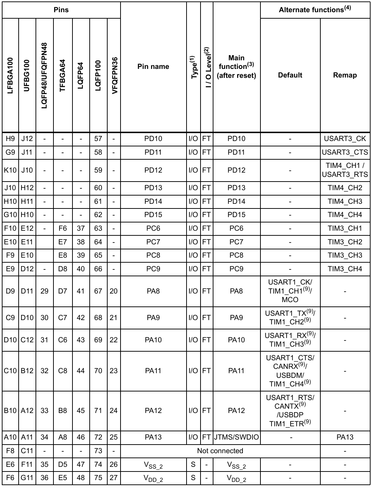

#### 💡 **Ví dụ thực tế:**

```c
/* 
🎯 PA13 mặc định là SWDIO (dùng cho debug/programming)
⚠️  Nếu muốn dùng PA13 làm GPIO thông thường cần config AFIO
💡 Tuy nhiên trong thực tế:
   ✅ Nên dùng chân GPIO khác chưa sử dụng
   ✅ Hoặc dùng module mở rộng I/O qua I2C/SPI
*/
```

> ⚠️ **Lưu ý:** Chúng ta vẫn viết driver AFIO để sẵn sàng sử dụng khi cần thiết!

---

## ⚡ Chương 06: INTERRUPT (External Interrupt - EXTI)

### 🧠 **NVIC - Nested Vectored Interrupt Controller**


> 🎯 **NVIC** là trung tâm xử lý tất cả các ngắt trong STM32, giúp CPU nhận diện và xử lý đúng loại ngắt.

#### 🔄 **Luồng xử lý ngắt:**


```mermaid
graph LR
    A[External Signal] --> B[EXTI] --> C[NVIC] --> D[CPU] --> E[ISR Handler]
```

### 📊 **I. NVIC Architecture**

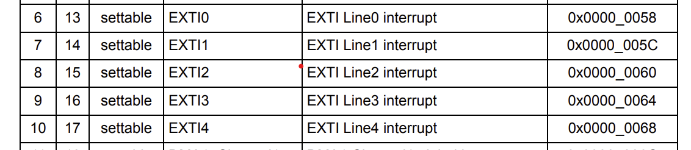

**Đặc điểm NVIC:**

- 🎯 **240 interrupt channels**
- ⚡ **16 priority levels**
- 🔄 **Nested interrupt support**
- 🚀 **Vector table** tự động

### 🔧 **II. EXTI Registers**

### 1. Interrupt mask register EXTI_IMR

Các line ngắt


Address offset: 0x00
Reset value: 0x0000 0000
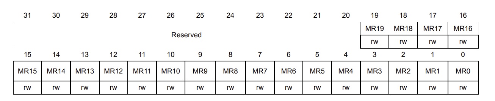
Dùng để bật ngắt line, dùng line ngắt nào thì phải bật line ngắt đó lên
VD: Muốn dùng ngắt ngoài chân PA0 thì phải set bit thứ 0 lên 1

```cpp
MR0 = 1
```

### 2. Rising trigger selection register EXTI_RTSR

Dùng cho mode Rising
Address offset: 0x08
Reset value: 0x0000 0000


Dùng để bật mode Rising cho line bất kỳ
VD: Muốn dùng ngắt Rising cho line 0 thì phải set bit thứ 0 lên 1

```cpp
TR0 = 1
```

### 3. Falling trigger selection register EXTI_FTSR

#### 📝 **3. Falling Trigger Selection Register (EXTI_FTSR)**

> 🎯 **Chức năng:** Cấu hình ngắt kích hoạt theo **cạnh xuống** (falling edge)

**Thông số:**

- 📍 **Address offset:** 0x0C  
- 🔄 **Reset value:** 0x0000 0000

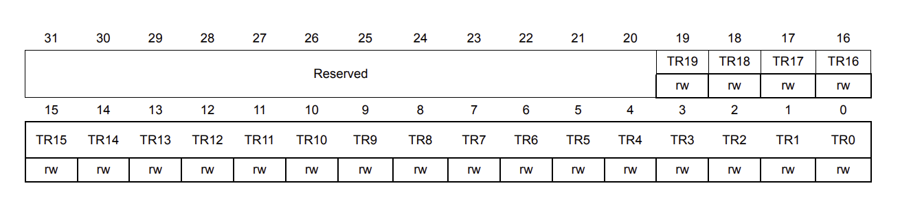

**Ví dụ cấu hình:**

```c
EXTI->FTSR |= (1 << 0);  // 🔽 Enable falling edge cho Line 0
```

#### 📝 **4. Pending Register (EXTI_PR)**

> 🎯 **Chức năng:** Hiển thị trạng thái ngắt đang chờ xử lý

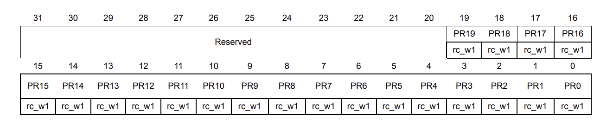

**Cơ chế hoạt động:**

- ⚡ Khi ngắt xảy ra → bit tương ứng = 1
- 🧹 Sau khi xử lý ngắt → **phải clear bit** bằng cách write 1

```c
// 🧹 Clear pending bit cho Line 0
if (EXTI->PR & (1 << 0)) {
    EXTI->PR |= (1 << 0);  // Write 1 to clear
}
```

#### ⚠️ **5. Cấu hình NVIC (Nested Vectored Interrupt Controller)**

```c
// 🎯 NVIC Interrupt Set Enable Register 0
#define NVIC_ISER0  (*(volatile uint32_t*)0xE000E100)

// 🔛 Enable EXTI0 interrupt
NVIC_ISER0 |= (1 << 6);  // EXTI0 IRQ = 6
```

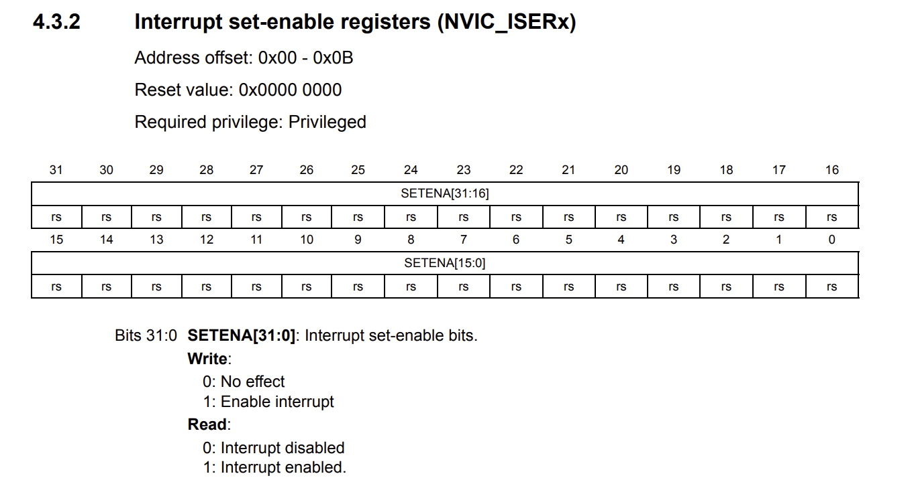

---

### 🛠️ **6. Quy trình cấu hình EXTI hoàn chỉnh**

#### 📋 **Các bước thực hiện:**

| 🔢 **Bước** | 🛠️ **Thao tác** | 📝 **Mô tả** |
|:----------:|:---------------|:-------------|
| **1** | **GPIO Config** | Cấu hình chân làm input (pull-up/down nếu cần) |
| **2** | **AFIO Config** | Chọn GPIO port cho EXTI line (EXTICR) |
| **3** | **EXTI Config** | Bật mask (IMR) + chọn edge (RTSR/FTSR) |
| **4** | **Clear Flag** | Xóa pending flag (PR) nếu có |
| **5** | **NVIC Enable** | Enable interrupt trong NVIC (ISER) |
| **6** | **IRQ Handler** | Viết hàm xử lý ngắt |

#### 💻 **Template code tổng quát:**

```c
// 🔧 Step 1-3: GPIO + AFIO + EXTI Configuration
void EXTI_Config(void) {
    // Step 1: GPIO as input
    // Step 2: AFIO->EXTICR để chọn port
    // Step 3: EXTI->IMR, EXTI->RTSR/FTSR
    
    // Step 4: Clear pending
    EXTI->PR |= (1 << line);
    
    // Step 5: Enable NVIC
    NVIC_ISER0 |= (1 << IRQ_number);
}

// 🎯 Step 6: IRQ Handler template
void EXTIx_IRQHandler(void) {
    if (EXTI->PR & (1 << line)) {
        // 🎯 Xử lý logic ngắt ở đây
        
        // 🧹 Clear pending flag (BẮT BUỘC!)
        EXTI->PR |= (1 << line);
    }
}
```

---

## ⏰ Chương 07: TIMER (Timer/Counter)

### 🎯 **Mục tiêu chương Timer:**

- ⏱️  Hiểu cách hoạt động của Timer/Counter
- 🔧 Cấu hình Timer cho các chế độ khác nhau
- 🌊 Tạo tín hiệu PWM chất lượng cao
- 📏 Đo thời gian và tần số chính xác

### 📖 **Tổng quan về Timer STM32F1**

> ⏰ **Timer** là peripheral quan trọng nhất cho việc đo thời gian, tạo delay chính xác, và sinh PWM.

#### 🏷️ **Các loại Timer trong STM32F1:**

| 🏷️ **Loại** | 📊 **Số lượng** | 🔧 **Chức năng** | 📝 **Ứng dụng** |
|:----------:|:-------------:|:---------------|:-------------|
| **Advanced** | TIM1 | 16-bit + Dead-time + Break | Motor control, Power |
| **General** | TIM2,3,4 | 16-bit đa năng | PWM, Input Capture |
| **Basic** | TIM6,7 | 16-bit cơ bản | Delay, Timebase |

### 🔧 **Các thanh ghi Timer quan trọng:**

#### 📋 **1. CR1 (Control Register 1) - Điều khiển chính**

```c
TIMx->CR1 |= TIM_CR1_CEN;   // 🚀 Bật counter (bắt đầu đếm)
TIMx->CR1 &= ~TIM_CR1_CEN;  // ⏸️  Tắt counter  
TIMx->CR1 |= TIM_CR1_ARPE;  // 🔄 Bật auto-reload preload
```

#### 📋 **2. PSC (Prescaler Register) - Chia tần số**

```c
TIMx->PSC = config.Prescaler;  // 🔧 Chia tần số clock đầu vào
// Tần số timer = Tần số bus / (PSC + 1)
```

#### 📋 **3. ARR (Auto-Reload Register) - Chu kỳ đếm**

```c
TIMx->ARR = config.AutoReload;  // 🔄 Giá trị đếm tối đa
// Khi CNT = ARR → counter reset về 0
```

#### 📋 **4. CNT (Counter Register) - Giá trị hiện tại**

```c
TIMx->CNT = 0;              // 🔄 Reset counter về 0
uint32_t current = TIMx->CNT;  // 📊 Đọc giá trị hiện tại
```

#### 📋 **5. EGR (Event Generation Register) - Tạo sự kiện**

```c
TIMx->EGR |= TIM_EGR_UG;    // ⚡ Tạo Update Event
// Cập nhật các giá trị preload (PSC, ARR, CCRx)
```

#### 📋 **6. CCMR1/CCMR2 (Capture/Compare Mode Register)**

> 🎯 **Chức năng:** Cấu hình chế độ hoạt động cho các channel PWM/OC

**Phân chia:**

- 📡 **CCMR1:** Channel 1, 2
- 📡 **CCMR2:** Channel 3, 4  

#### 📋 **7. CCER (Capture/Compare Enable Register)**

```c
TIMx->CCER |= TIM_CCER_CC1E;  // 🔛 Enable Channel 1 output
TIMx->CCER |= TIM_CCER_CC2E;  // 🔛 Enable Channel 2 output
```

#### 📋 **8. CCR1-4 (Capture/Compare Register)**

```c
TIMx->CCR1 = dutyCycle;  // 🌊 Duty cycle cho PWM Channel 1
TIMx->CCR2 = dutyCycle;  // 🌊 Duty cycle cho PWM Channel 2
```

#### 📋 **9. BDTR (Break and Dead-Time Register - TIM1 only)**

```c
TIM1->BDTR |= TIM_BDTR_MOE;  // 🚀 Master Output Enable (TIM1)
```

---

## 📊 Chương 08: ADC (Analog to Digital Converter)

### 🎯 **Mục tiêu chương ADC:**

- 📏 Hiểu nguyên lý hoạt động của ADC
- ⚙️ Cấu hình ADC cho đo single/continuous
- 📊 Xử lý dữ liệu analog chính xác
- 🔄 Sử dụng DMA cho ADC hiệu quả

### 📖 **1. Giới thiệu về ADC**

> 📊 **ADC** chuyển đổi tín hiệu analog (điện áp) thành giá trị digital để vi điều khiển xử lý.

#### ⚡ **Thông số quan trọng của ADC:**

```text
- Độ phân giải
Thường đo bằng số bit (8-bit, 10-bit, 12-bit, 16-bit, 24-bit,...).
Độ phân giải càng cao, khả năng biểu diễn tín hiệu càng chính xác.
   →  STM32GF103    12 bits

```

```text
- Điện áp tham chiếu
→ Vref  : 3.3 V
```

```text
Tốc độ lấy mẫu
→Tốc độ càng cao thì lấy càng chuẩn

```

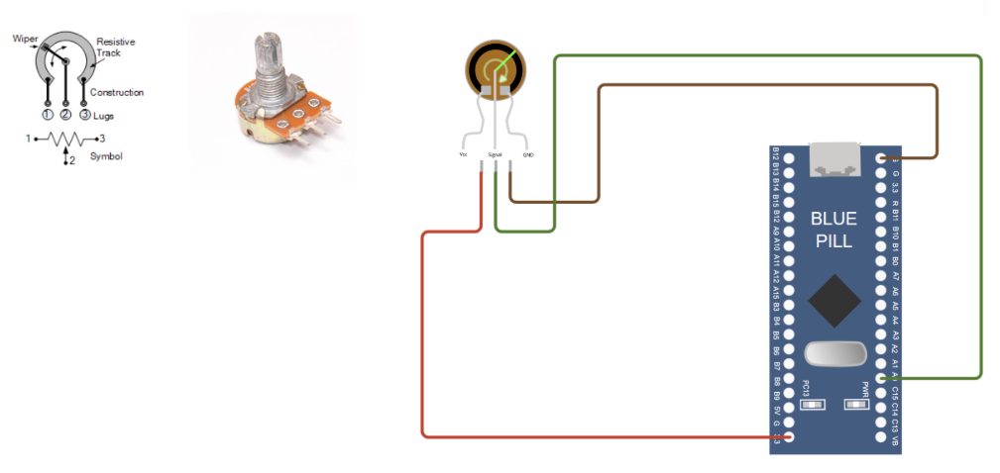

### 2. Thanh ghi ADC control register 2 (ADC_CR2)

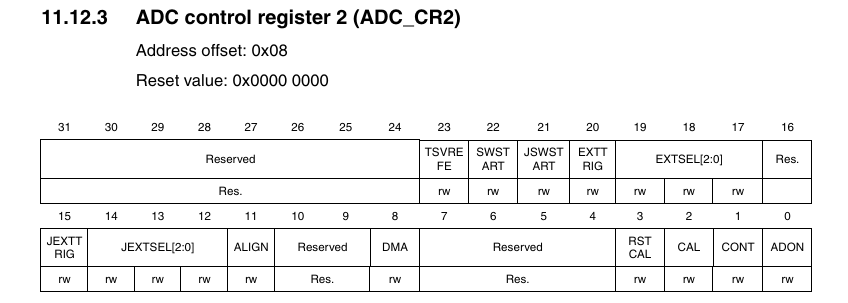
Có 2 bit quan trọng liên quan đến enable ADC và chọn mode ADC
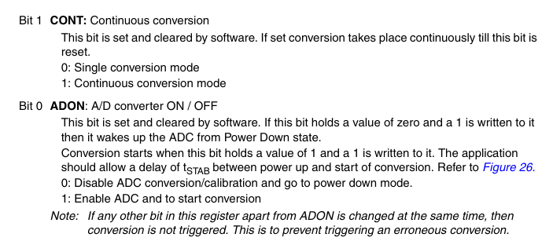

```cpp
CONT = 1: Chọn chế độ, thông thường sẽ dùng chế độ liên tục
Chế độ liên tục: Sau mỗi lần chuyển đổi, ADC sẽ tự bắt đầu lần tiếp theo
```

```cpp
ADON = 1: Bật ADC
Lần đầu ghi 1 vào bit này để bật ADC, lần thứ hai để thực sự bắt đầu
```

```cpp
RSTCAL = 1: Reset bộ hiệu chỉnh
Bản chất trong bộ ADC nào cũng sẽ có bộ hiệu chỉnh giúp cho ADC của mình đọc chính xác hơn, mình sẽ cần reset bộ hiệu chỉnh trước khi bắt đầu
```

```cpp
CAL = 1: Bắt đầu bộ hiệu chỉnh
Bản chất trong bộ ADC nào cũng sẽ có bộ hiệu chỉnh giúp cho ADC của mình đọc chính xác hơn, mình sẽ cần reset bộ hiệu chỉnh trước khi bắt đầu
```

```cpp
SWSTART = 1: Bắt đầu quá trình chuyển đổi
Dùng phần mềm set bit này lên để bắt đầu quá trình chuyển đổi
```

### 3. Thanh ghi SMPR2

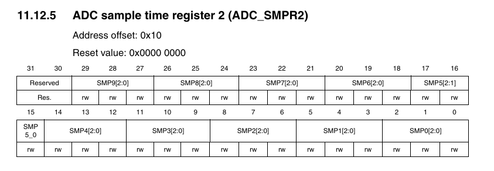

- Với mỗi một bộ ADC, thì thời gian lấy mẫu hay nói cách khác chu kì lấy mẫu là rất quan trọng, thanh ghi này dùng để set thời gian lấy mẫu
- Thời gian lấy mẫu càng lâu thì càng chính xác

### 4. Thanh ghi SR

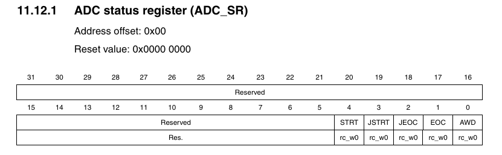

```text
EOC : Kết thúc quá trình chuyển đổi
Kiểm tra khi nào nó chuyển đổi xong thì mình đọc giá trị ra là được
```

### 5. Thanh ghi DR

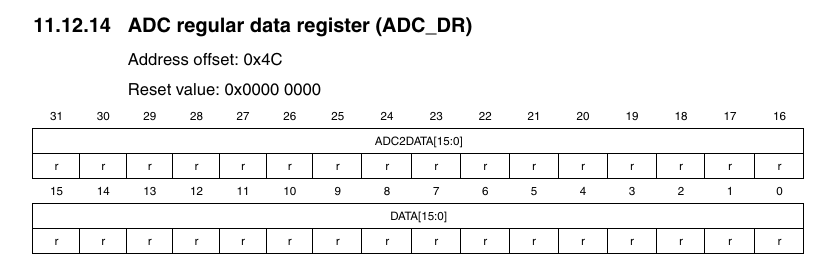

```text
Thanh ghi data, chỉ đọc
```

## Chương 09 UART

## Chương 10 SPI

Về cơ bản, thì mọi người cần quan tâm nhiều nhất đến thanh ghi CR, SR, DR

### 1. Thanh ghi SPIx_CR1

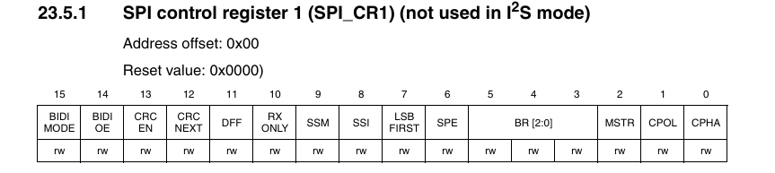

```cpp
Bit   |Tên      |Chức năng
----------------------------------------------------
6   |SPE      |SPI enable
2   |MSTR      |Chọn Master mode
3–5   |BR[2:0]   |Tốc độ SPI (chia xung từ PCLK)
9   |SSM      |Quản lý CS bằng phần mềm
8   |SSI      |Đặt giá trị mặc định CS nếu SSM = 1
```

### 2. Thanh ghi SPIx_SR

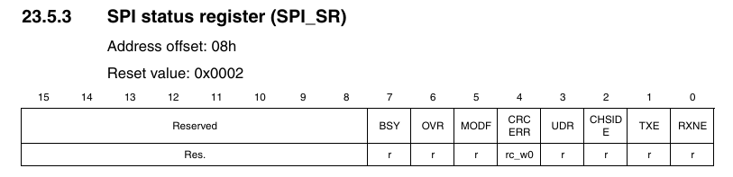

```cpp
Bit |Tên |Chức năng
1 |TXE |1 = sẵn sàng gửi
0  |RXNE |1 = có dữ liệu nhận
7 |BSY |1 = bận
```

### 3. Thanh ghi SPIx_DR

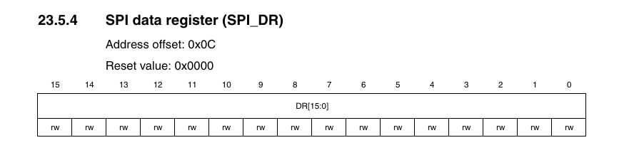
Đây là thanh ghi giúp mình gửi hoặc nhận data với SPI

### 4. Lưu ý

Phải config như sau nhé các chế

```cpp
PA5 (SCK) – Alternate Function Push Pull

PA7 (MOSI) – Alternate Function Push Pull

PA6 (MISO) – Input Floating

PA0 (CS) – Output Push Pull (Notee: Mình có thể chủ động chọn GPIO mình muốn)
```

## Chương 11 I2C

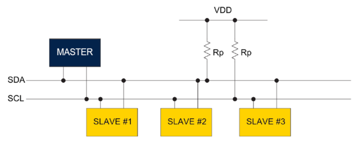
Giao tiếp thông qua địa chỉ của slave

Frame truyền của I2C
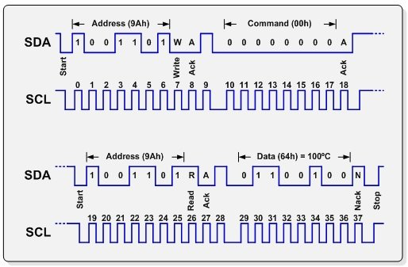

### 1. Thanh ghi CR1

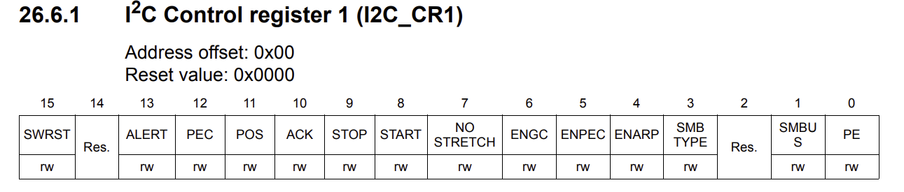
Hai bit quan trọng: start và stop dùng để start và stop frame truyền
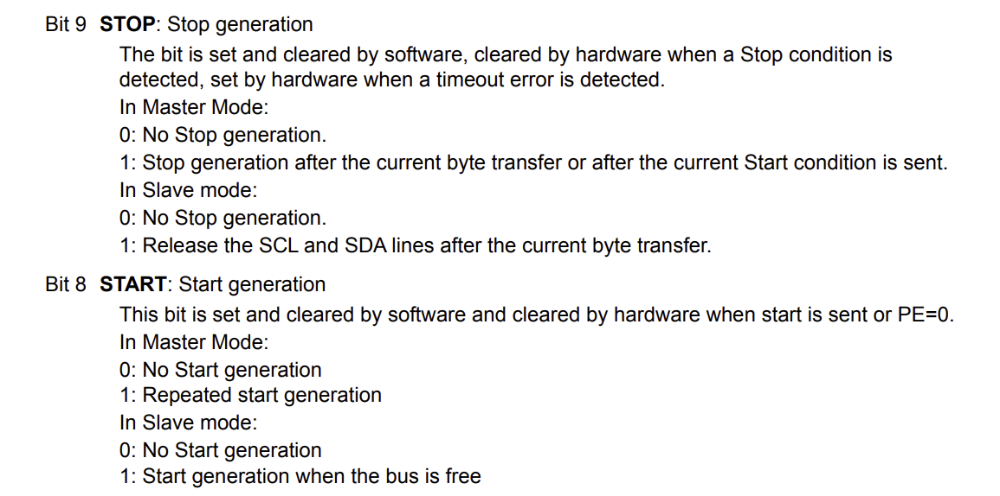
Một số bit quan trọng

```cpp
bit 0: enable peripheral
bit 8: start
bit 9: stop
bit 10: cho phép tạo ACK sau khi nhận tín hiệu
```

### 2. Thanh ghi CR2

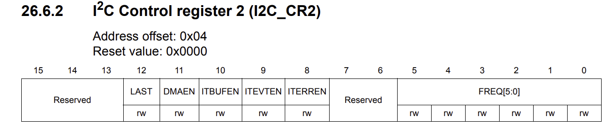

```cpp
Bit |Tên      |Chức năng
------------------------------------------
FREQ    |Clock MHz   |Set clock theo APB
```

### 3. Thanh ghi SR1

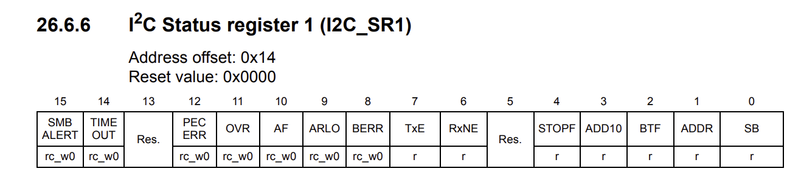
Một vài bit quan trọng

```cpp
Bit      |Name   | Chức năng
-------------------------------------------------------------------------------------------
0  |SB   | Master vừa gửi điều kiện START thành công
1  |ADDR    | Đã gửi địa chỉ xong, slave đã ACK
2  |BTF   | (Byte Transfer Finished) Đã truyền/nhận xong một byte, và DR trống
6  |RXNE    | (Receive buffer not empty) Có dữ liệu mới nhận trong DR
7  |TXE   | (Transmit buffer empty) Gửi xong byte hiện tại, sẵn sàng gửi byte tiếp theo
10       |STOPF   | STOP được nhận trong chế độ Slave
```

Lưu ý: Để clear ADDR Flag trong SR1 phải read SR2 ra, tài liệu đã chỉ như vậy
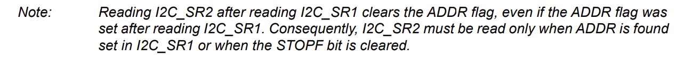

### 4. Thanh ghi SR2

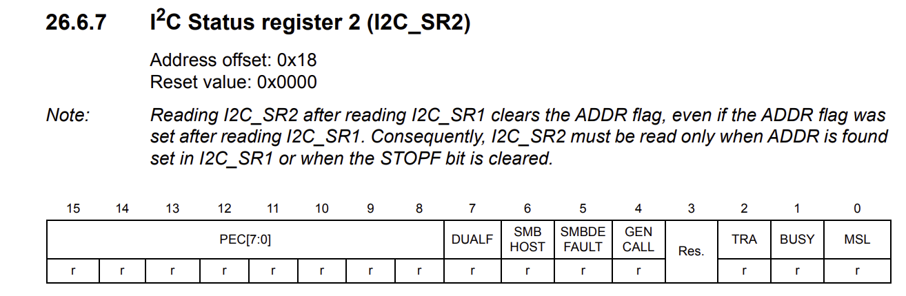
Các bit quan trọng

```cpp
1 |BUSY   | Bus đang hoạt động
0 |MSL | Master/Slave
2 |TRA | Transmitter/Receiver
```

### 5. Thanh ghi CCR

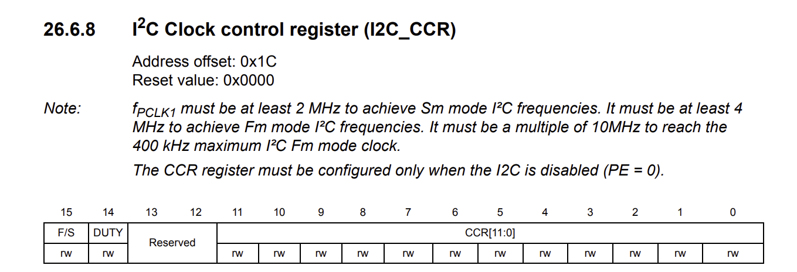
Các bit quan trọng

```cpp
Bit |Name      |Chức năng
15  |F/S       |0 = Standard mode (≤100kHz), 1 = Fast mode (≤400kHz)
14  |DUTY      |Nếu Fast Mode: 0 = duty 2 (T_low/T_high = 2), 1 = duty 16/9
12:0|CCR[11:0] |Giá trị xác định chu kỳ SCL (tùy thuộc mode chuẩn/nhanh)
```

### 6. Thanh ghi TRISE

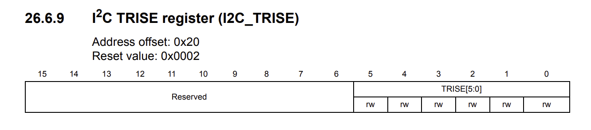
Dùng để thiết lập giới hạn thời gian tăng (rise time) tối đa của tín hiệu SCL
Ví dụ thực tiễn
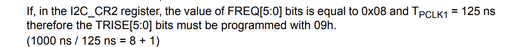

### 7. Thanh ghi DR

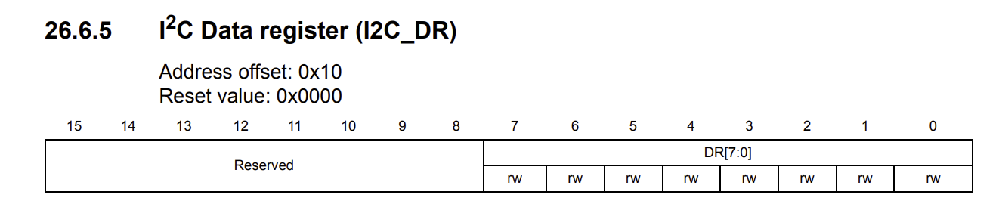
Thanh ghi này chắc không cần phải nói nhiều nữa, nó là thanh ghi data

## Chương 12 USB

### PHẦN 01: TỔNG QUAN

Giao thức USB, còn được gọi là Universal Serial Bus, lần đầu tiên được tạo ra và giới thiệu vào năm 1996 để có thể dùng chung 1 giao tiếp trên vô số thiết bị điện tử khác nhau

Có rất nhiều thiết bị sử dụng giao tiếp USB để kết nối như:

- Bàn phím.
- Chuột máy tính.

```cpp
|Chế độ         | Viết tắt |Tốc độ truyền nhận              |Phiên bản
---------------------------------------------------------------------
| Low speed | LS       |1.5 Mbit/s (187.5 KB/s)     |USB 1.0
| Full speed | FS    |12 Mbit/s (1.5 MB/s)     |USB 1.0
| High speed | HS    |480 Mbit/s (60 MB/s)     |USB 2.0
| SuperSpeed | SS    |5 Gbit/s (625 MB/s)             |USB 3.0
| SuperSpeed+ | SS+    |10 Gbit/s (1.25 GB/s)     |USB 3.1
| SuperSpeed+ | SS+    |20 Gbit/s (2.5 GB/s)     |USB 3.2
```

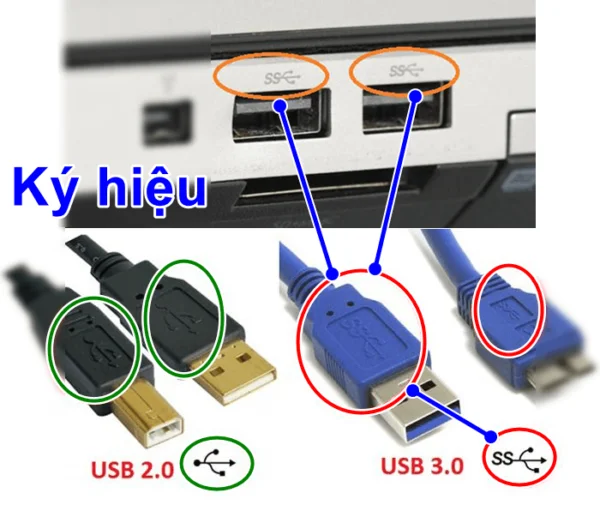

```cpp
Với USB 2.0
Nó thường có 4 chân    | VCC | GND | D+ | D- |
```

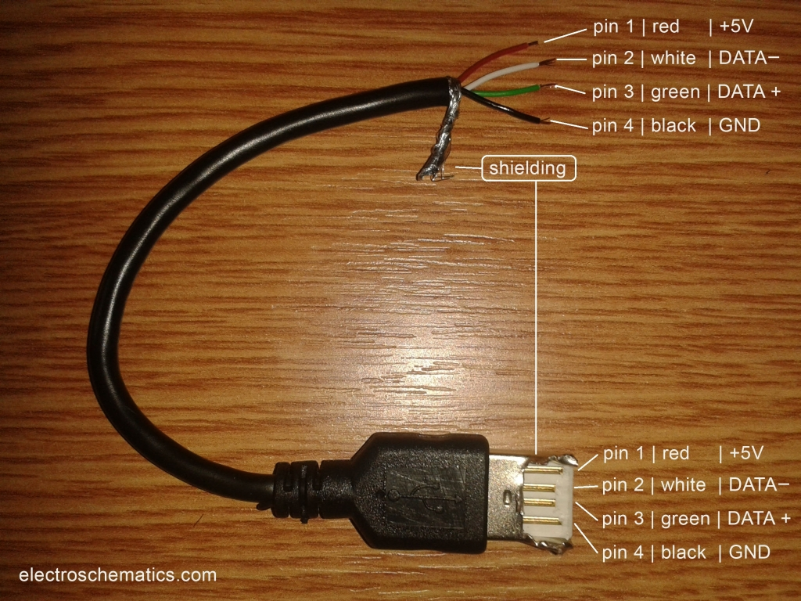

### PHẦN 02: GIỚI THIỆU VỀ USB

```cpp
Một hệ thống USB sẽ gồm các thành phần:
- USB devices: bàn phím, chuột,...
- USB host: máy chủ
- USB interconnect: hub, bus giao tiếp, nó là các thành phần trung gian để giúp device giao tiếp với host
```

```cpp
Một USB Interconnect bao gồm các thành phần con như sau:
- Bus Topology: Kiểu kết nối giữa USB device và USB host.
- Inter-layer Relationship
- Data Flow Models: Cách thức data được trao đổi giữa USB producer và consumer.
- USB Schedule
USB kết nối theo kiểu hình cây theo tầng. Trong đó, hub là một center của mỗi cây con, mỗi cạnh là một kết nối point-to-point giữa host và hub hoặc function,
hoặc hub kết nối tới một hub khác hoặc function.USB devices có thể là Hub hoặc Function.
```

#### 2.1 Các trạng thái (state)

```cpp
- IDLE state

Low speed: D- high, D+ low
Full speed: D+ high, D- low

- J state
- K state
```

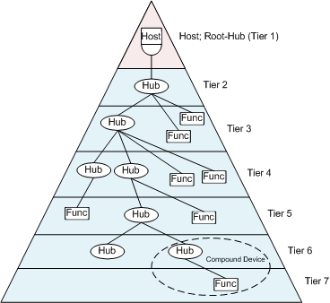

### PHẦN 03: USB PROTOCOL

#### 3.1 Các trường dữ liệu trong packet

Mỗi một packet lại có cái trường (field) riêng, trong đó:

- Sync field: Tất cả các packet phải được bắt đầu bằng trường Sync. Trường này dài 8 bit (full/low speed) hoặc 32 bit (high speed) và được sử dụng để đồng bộ clock giữa receiver và transmitter. Hai bit cuối cho biết nơi bắt đầu của trường PID.
- Packet Identifier Field - PID nghĩa là Packet ID. Trường này được sử dụng để xác định loại packet được gửi, nó gốm 4 bit cao để xác định, 4 bit cuối để check 4 bit đầu
  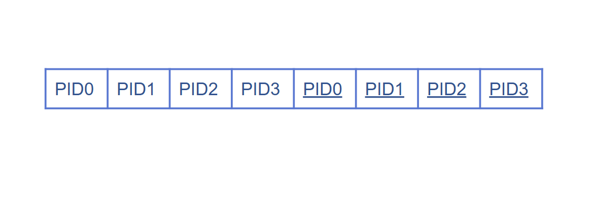
  Các PID được thể hiện tại bảng sau:

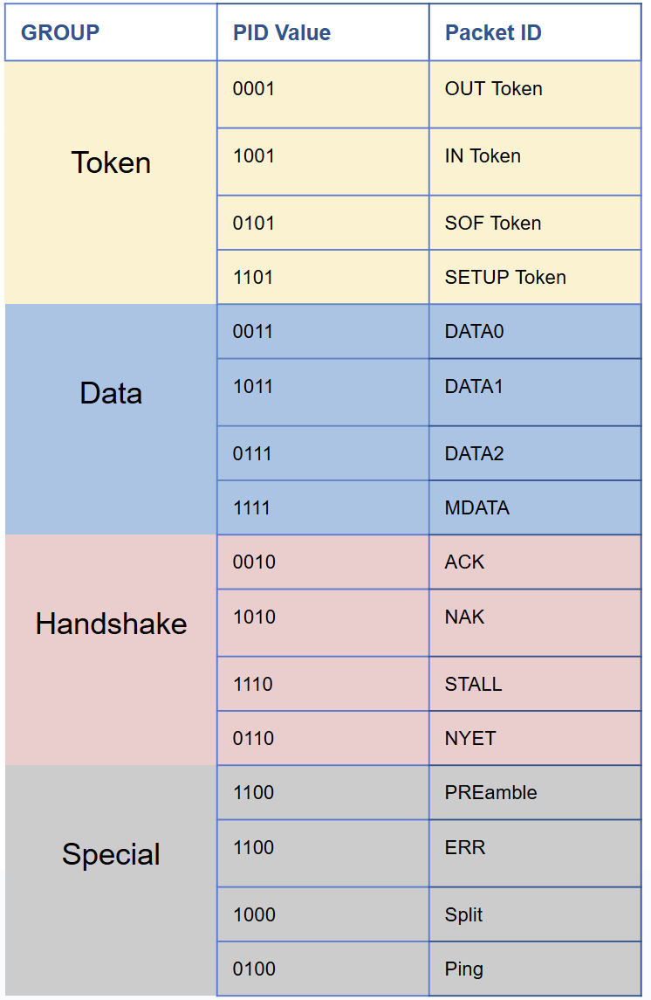

- Function Address Field: Cho biết địa chỉ của function cụ thể. Độ dài 7 bit cho phép hỗ trợ 127 device. Address 0 không hợp lệ vì nó được dùng làm default address.
- Endpoint Field: Độ dài 4 bit cho phép hỗ trợ 16 endpoint. Tuy nhiên, đối với low speed device chỉ có thêm 2 endpoint được thêm với default pipe (max 3 endpoint).
- Data Field: Trường dữ liệu có thể nằm trong khoảng 0 đến 1024 byte. Các bit trong mỗi byte được dịch từ LSB đầu tiên. Kích thước của data field tuỳ thuộc vào transfer type.
- Cyclic Redundancy Checks - CRC: được sử dụng để bảo vệ tất cả các trường không phải là PID trong token và data packet. Các token packet có 5 bit CRC, trong khi data packets có 16 bit CRC.
- End Of Packet - EOP: cho biết packet kết thúc.

#### 3.2 Các packet USB


Start of Frame Packets: Sử dụng để chỉ ra sự bắt đầu của một khung dữ liệu mới.
Token Packets: Cho biết loại giao dịch phải tuân theo.
Data Packets: Gói chứa dữ liệu cần truyền, nhận.
Handshake Packets: Sử dụng để xác nhận các gói dữ liệu đã nhận hoặc để báo cáo lỗi…

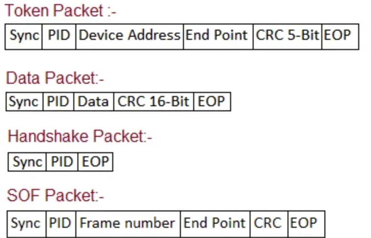

##### 3.2.1 Start of Frame Packets

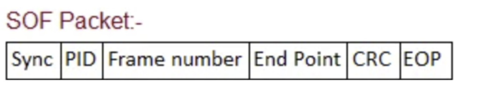
Báo hiệu bắt đầu 1 frame mới
Packet SOF, chứa dữ liệu là một giá trị 11 bit

##### 3.2.1 Token packets

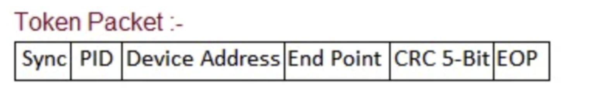
Có 3 loại packets token
IN – Báo cho USB Device biết host muốn đọc thông tin từ nó
OUT – Báo cho USB Device biết host gửi thông tin cho nó
SETUP – Báo cho USB Device biết host sẽ truyền thông tin điều khiển

##### 3.2.2 Data packets

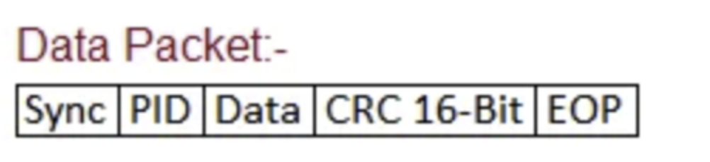
Có 2 loại Packet data, mỗi loại đều có thể truyền tối đa 1024 byte dữ liệu.

- Data0
- Data1

Ở Low Speed, cho phép tối đa 8 bytes payload.(phần Data ở định dạng trên)
Ở Full Speed, cho phép tối đa 1023 byte payload.
Ở High Speed, cho phép tối đa 1024 bytes.
Data phải được gửi thành nhiều byte.
✌️Note:
USB cung cấp một cơ chế động bộ hoá dữ liệu giữa transmitter và receiver. Cơ chế này nhằm đảm bảo rằng việc bắt tay giữa các transaction được chính xác. Cơ chế này được sử dụng thông qua DATA0 và DATA1.

```cpp
Cơ chế hoạt động như sau:
- Một endpoint duy trì một trạng thái toggle bit: 0 hoặc 1.
- Data packet gửi đi sẽ được đánh dấu là DATA0 hoặc DATA1, tương ứng với trạng thái toggle hiện tại.
- Sau mỗi lần truyền thành công, host và device sẽ đảo trạng thái toggle, tức là từ 0  1 hoặc 1  0.
- Nếu host hoặc device nhận được data packet với toggle bit không đúng với mong đợi, nó sẽ ignore và yêu cầu gửi lại.
```

Ex:

```cpp
Giả sử host gửi dữ liệu tới device:
- Lần đầu: Host gửi gói DATA0, device nhận và phản hồi ACK.
- Lần sau: Host gửi DATA1, device phản hồi ACK.
👌 Nếu host không nhận được ACK, nó sẽ gửi lại DATA1.
✌️ Device kiểm tra toggle bit. Nếu nó trùng với lần trước, device biết là gói cũ, và có thể bỏ qua.
```

##### 3.2.3 Handshake packets

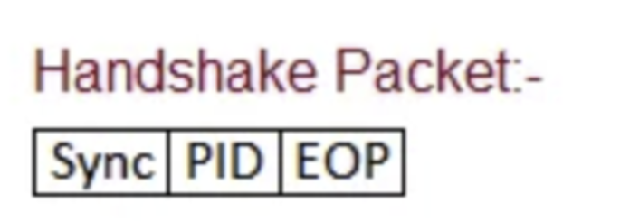
Có 3 loại Packet Handshake là :

- ACK – Cho biết Packet đã được gửi nhận thành công chưa
- NAK – Cho biết Device không tạm thời không thể gửi hoặc nhận dữ liệu. Ngoài ra, gói này cũng được sử dụng trong Transaction dạng Interrupt để báo cho host biêt rằng device chẳng ó gì để gửi.
- STALL – Device báo rằng trạng thái hiện tại cần cần thiệp từ phía Host.

### PHẦN 04: USB DEVICE

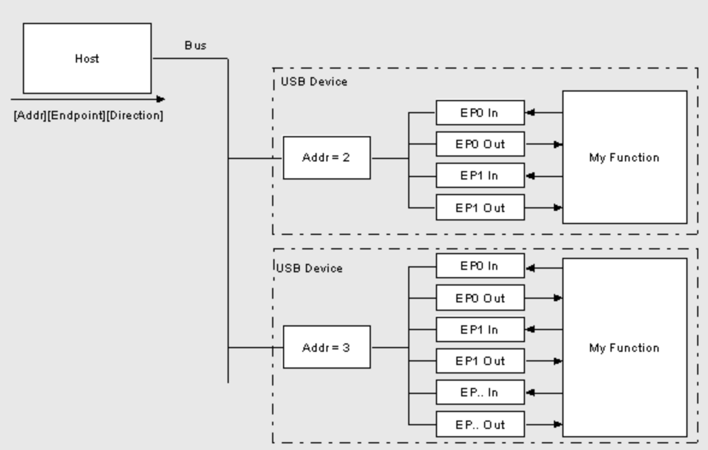

#### EndPoint

EndPoint chưa buffer: hiểu đơn giản nó là bể chứa dữ liệu cũng được
Phần mềm sẽ phải xử lý ngắt, đọc dữ liệu từ buffer của EndPoint, rồi parse Device Descriptor Request.
Giả sử driver gửi một Packet đến EP1 của thiết bị. Dữ liệu này được ném từ Host, và trôi xuống EP1 OUT Buffer. Firmware phía USB Functions cứ thế đọc dữ liệu này. Rồi xử lý tóe loe gì đó. Sau đó nếu nó muốn trả dữ liệu nào đó về Host, USB Functions lại không thể tống dữ liệu đó vào cái Channel lúc trước được (vì ngược chiều, đâm nhau thì toi). Vì thế, nó ghi dữ liệu vào EP1 IN Bufer. Dữ liệu được ghi vào cứ nằm ở đấy đến khi nào Host gửi Packet IN (yêu cầu lấy dữ liệu) thì mới được chuyển đi

```cpp
EP_IN:
EP_OUT:
```

#### Pipes

Pipe là một kết nối logical giữa Host và 1 hoặc nhiều Endpoint, coi nó như kênh truyền cũng được

- Cấu trúc của Pipe thường bao gồm:

```cpp
- Địa chỉ endpoint: Mỗi pipe được xác định thông qua địa chỉ của endpoint.
- Hướng truyền tải: Pipe có thể truyền dữ liệu từ host tới device (IN) hoặc từ device tới host (OUT).
- Loại transfer: Xác định cách thức dữ liệu sẽ được truyền (control, bulk, interrupt,...).
    + Control (được sử dụng trong các yêu cầu điều khiển)
    + Bulk (dành cho các truyền tải dữ liệu lớn)
    + Interrupt (dành cho các truyền tải có độ trễ thấp)
- Tốc độ và băng thông: Mỗi loại transfer có tốc độ và băng thông khác nhau
```

```cpp
Có 2 loại
- Stream Pipe (Pipe dạng dòng): truyền dữ liệu không định dạng trước, khi sử dụng loại này bạn có đơn giản là có thể gửi bất cứ dữ
liệu gì ở 1 đầu, và lấy dữ liệu ra ở đầu còn lại. Luồng dữ liệu sử dụng Pipe này thường được định nghĩa trước, hoặc là IN hoặc là
OUT. Pipe dạng dòng hỗ trợ phương thức truyền Bulk, Isochronous và Interrupt. Stream có thể được điều khiển (controlled về phần
mềm) bởi Host hoặc Device.
- Message Pipi (Pipe truyền messsage): Dùng để truyền dữ liệu đã được định nghĩa theo USB Format. Được điều khiển cũng như xuất
phát từ Host. Dữ liệu được truyền đi theo hướng mong muốn dựa trên request từ Host. Nó hỗ trợ truyền dữ liệu cả 2 hướng và chỉ hỗ
trợ Control Transfer thôi
```

### PHẦN 05: USB COMMUNICATION FLOW

- Cơ chế truyền dữ liệu liên quan đến việc host đọc và ghi vào các bộ nhớ trên mỗi thiết bị. Các bộ nhớ này được gọi là endpoint. Về cơ bản, có thể hiểu các endpoint là các buffer in và out.
  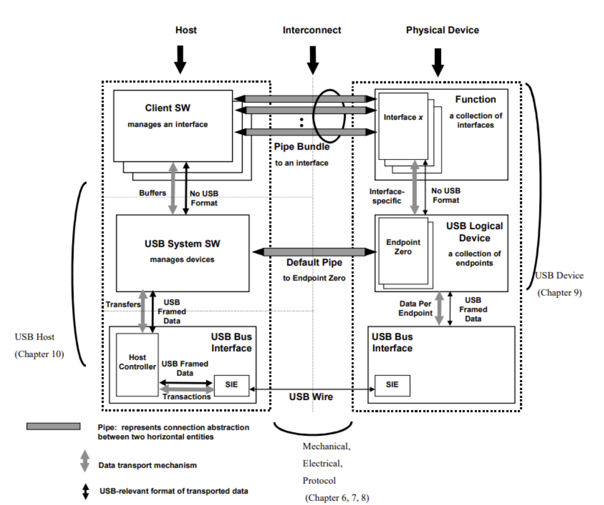

- Khi host muốn gửi data đến một device, data được lưu tại endpoint OUT của device thông qua việc sử dụng WRITE transaction. Firmware device sẽ giám sát các endpoint OUT để xác định xem có data nào được nhận từ host hay không.
  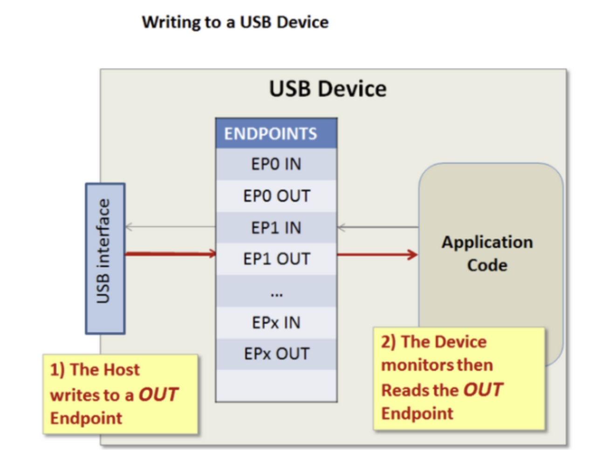
- Nếu device muốn giao tiếp với host, data sẽ được lưu tại endpoint IN. Data sẽ vẫn nằm tại endpoint IN cho đến khi host release READ transaction. READ transaction khiến data của endpoint IN được gửi đến máy chủ.
  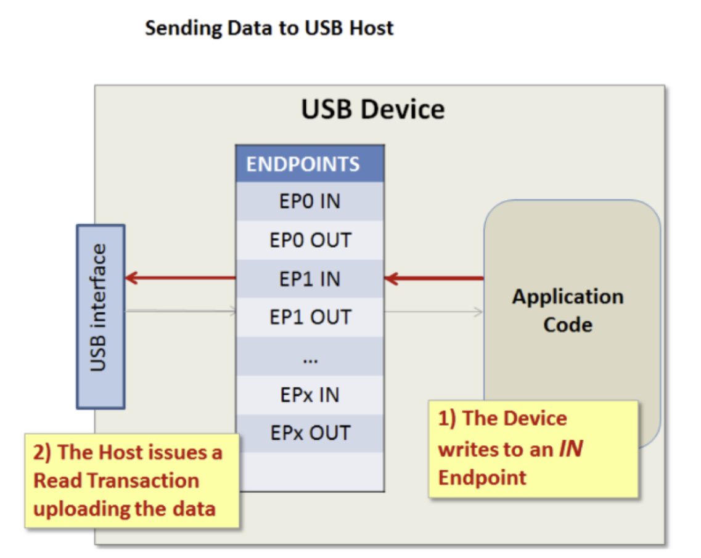

### PHẦN 06: STM32 USB CDC

Khi sử dụng thằng này thì chính là sử dụng thông qua Bulk

- Bulk Transfer được sử dụng khi cần truyền tải lượng dữ liệu lớn (ví dụ như khi sử dụng thiết bị USB như serial port hoặc các thiết bị lưu trữ như USB flash drives)

#### 6.1 USB CDC là gì?

Trong STM32f103c8t6 chỉ hỗ trợ giao thưc USB kiểu Device, thế nên ta sẽ sử dụng kit Bluepill như một thiết bị để truyền nhận dữ liệu giữa nó và máy tính.

#### 6.2 Lập trình USB CDC với STM32

Cùng code và đọc 2 chân tín hiệu D+, D- để biết dữ liệu được truyền đi như thế nào


## Chương 13 USB CDC

## PHẦN 01: Lý thuyết cơ bản cần nắm vững trong USB STM32

### 1. Thanh ghi USB interrupt status

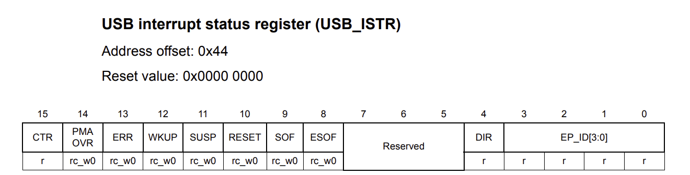
Chú ý 2 bit sau đây

```cpp
- bit 15: CTR: Correct transfer: Được hardware set, mình sẽ check bit này để xác nhận giao dịch
" endpoint has successfully completed a transaction"
- Bit 10 RESET: USB reset request
```

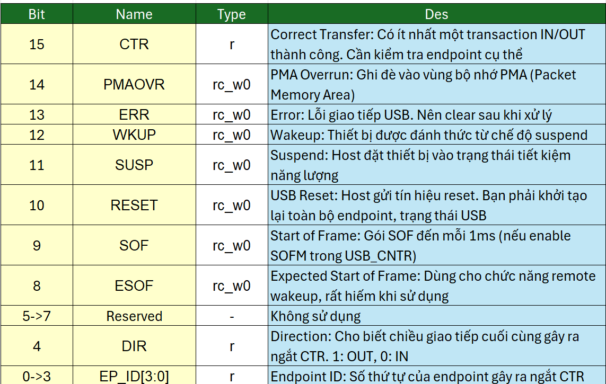
Về cơ bản mình cần thiết lập ngắt để hứng các sự kiện ngắt từ USB HOST

```cpp
void USB_LP_CAN1_RX0_IRQHandler(void)
{
    // Ví dụ như sự kiện cắm USB vào HOST gửi request nó sẽ vô đây đầu
    if (USB->ISTR.BITS.RESET != RESET)
    {
        USB_ResetCallBack();
    }

    if (USB->ISTR.BITS.CTR != RESET)
    {
        USB_TransactionCallBack();
    }

    if (USB->ISTR.BITS.ERR != RESET)
    {
        USB->ISTR.BITS.ERR = 0;
    }

    if (USB->ISTR.BITS.SOF != RESET)
    {
        USB->ISTR.BITS.SOF = 0;
    }

    if (USB->ISTR.BITS.ESOF != RESET)
    {
        USB->ISTR.BITS.ESOF = 0;
    }

    if (USB->ISTR.BITS.SUSP != RESET)
    {
        USB->ISTR.BITS.SUSP = 0;
    }
}
```

### 2. Thanh ghi USB_DADDR, setup device address và enable function

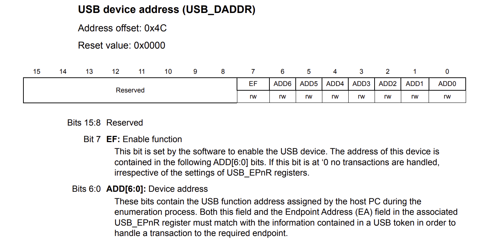

```cpp
void USB_ResetCallBack(void)
{
    // Reset cờ
    USB->ISTR.BITS.RESET = 0x00;
    // Init endpoint
    USB_EndpointInit(USB, ENDPOINT_TYPE_CONTROL, 0x80, 0x18, USB_MAX_EP_PACKET_SIZE);
    USB_EndpointInit(USB, ENDPOINT_TYPE_CONTROL, 0x00, 0x58, USB_MAX_EP_PACKET_SIZE);
    //Lúc nào cũng vậy, nó sẽ init ADD Device mặc định là 0x00 trước, quá trình config, get thông tin diễn ra xong, giao tiếp nó sẽ setup lại địa chỉ device
    USB->DADDR.BITS.EF = 0x01;
    USB->DADDR.BITS.ADD = 0x00;
}
```

Function USB_EndpointInit dùng để khởi tạo endpoint

```cpp
static void USB_EndpointInit(USB_Typedef* USBx, uint8_t type, uint8_t addr, uint16_t packetAddr, uint16_t maxPacketSize)
{
    // Set endpoint type
    uint8_t ep = 0;

    ep = addr & 0x7FU;
    USB_SET_TYPE_TRANSFER(USBx, ep, type);
    USB_SET_ENDPOINT_ADDRESS(USBx, ep);

    if ((addr & 0x80) == 0x80)      // IN endpoint
    {
        // Set bit STAT_TX & clear DTOG_TX
        USB_SET_STAT_TX(USBx, ep, STATUS_TX_NAK);
        USB_DATA_TGL_TX(USBx, ep, DATA_TGL_0);
    }
    else
    {
        // Set bit STAT_RX & clear DTOG_RX
        USB_SET_STAT_RX(USBx, ep, STATUS_RX_VALID);
        USB_DATA_TGL_RX(USBx, ep, DATA_TGL_0);
    }

    USB_BufferDescTable(addr, packetAddr, maxPacketSize);
}
```

Thanh ghi USB_EPnR
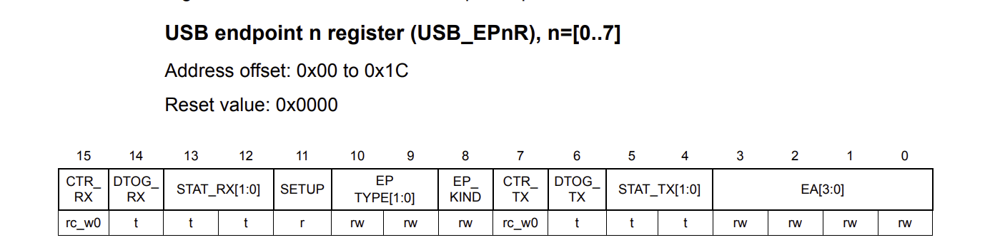
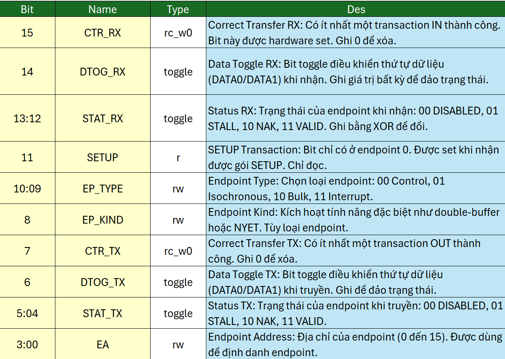

Với thanh ghi này, để dễ quản lý, chúng ta cần viết ra một vài các macro function

```cpp
// 8F8F = 1000 1111 1000 1111: Dùng thằng này để dữ lại một số bit, những bit toggle thì clear đi để khởi tạo lại
// Vì sao phải làm như vậy: bit toogle khi set thì sẽ clear thanh ghi, vì vậy phải để modify lại thì phải ghi lại cả thanh ghi. Và 8F8F là để giữ lại những bit thực sự cần giữ lại trước khi modify
//Thiết lập kiểu truyền (Transfer Type) của endpoint: là bit 10:9 của thanh ghi (Theo bảng *)
#define USB_SET_TYPE_TRANSFER(USBx, EP, TYPE)                       \
     do {                                                           \
         register uint16_t wValReg = 0;                             \
         wValReg = (USBx->EPnRp[EP].WORD & 0x8F8F) | ((TYPE) << 9); \
         USBx->EPnRp[EP].WORD = wValReg;                            \
     } while (0)                                                    \

//Thiết lập endpoint address chính là bit 0:3 trên bảng kia
#define USB_SET_ENDPOINT_ADDRESS(USBx, EP)                          \
     do {                                                           \
         register uint16_t wValReg = 0;                             \
         wValReg = (USBx->EPnRp[EP].WORD & 0x8F8F) | (EP);          \
         USBx->EPnRp[EP].WORD = wValReg;                            \
     } while (0)                                                    \
//Set status RX: Trạng thái nhận dữ liệu: bit 4-5 (Bảng ***)
#define USB_SET_STAT_RX(USBx, EP, STS)                          \
    do                                                          \
    {                                                           \
        register uint16_t _wRegVal = 0;                         \
        _wRegVal = (USBx->EPnRp[EP].BITS.STAT_RX ^ STS) << 12;  \
        _wRegVal = _wRegVal | (USBx->EPnRp[EP].WORD & 0x8F8F);  \
        USBx->EPnRp[EP].WORD = _wRegVal;                        \
    } while (0)                                                 \

//
#define USB_DATA_TGL_RX(USBx, EP, TGL)                          \
    do                                                          \
    {                                                           \
        register uint16_t _wRegVal = 0;                         \
        _wRegVal = (USBx->EPnRp[EP].BITS.DTOG_RX ^ TGL) << 14;  \
        _wRegVal = _wRegVal | (USBx->EPnRp[EP].WORD & 0x8F8F);  \
        USBx->EPnRp[EP].WORD = _wRegVal;                        \
    } while (0)                                                 \

//Set status TX: Trạng thái nhận dữ liệu: bit 12-13 (Bảng **)
#define USB_SET_STAT_TX(USBx, EP, STS)                          \
    do                                                          \
    {                                                           \
        register uint16_t _wRegVal = 0;                         \
        _wRegVal = (USBx->EPnRp[EP].BITS.STAT_TX ^ STS) << 4;   \
        _wRegVal = _wRegVal | (USBx->EPnRp[EP].WORD & 0x8F8F);  \
        USBx->EPnRp[EP].WORD = _wRegVal;                        \
    } while (0)                                                 \

#define USB_DATA_TGL_TX(USBx, EP, TGL)                          \
    do                                                          \
    {                                                           \
        register uint16_t _wRegVal = 0;                         \
        _wRegVal = (USBx->EPnRp[EP].BITS.DTOG_TX ^ TGL) << 6;   \
        _wRegVal = _wRegVal | (USBx->EPnRp[EP].WORD & 0x8F8F);  \
        USBx->EPnRp[EP].WORD = _wRegVal;                        \
    } while (0)                                                 \

/* Truoc khi su dung hai macro nay thi test xem lieu cac bit toggle trong thanh ghi co bi clear khi set bit bat ky hay khong */
/* Neu co thi su dung macro nay */

#define CLEAR_TRANSFER_TX_FLAG(USBx, EP)                            \
     do {                                                           \
         register uint16_t wValReg = 0;                             \
         wValReg = (USBx->EPnRp[EP].WORD & 0x8F8F) & ~(1 << 7);     \
         USBx->EPnRp[EP].WORD = wValReg;                            \
     } while (0)                                                    \

#define CLEAR_TRANSFER_RX_FLAG(USBx, EP)                            \
     do {                                                           \
         register uint16_t wValReg = 0;                             \
         wValReg = (USBx->EPnRp[EP].WORD & 0x8F8F) & ~(1 << 15);    \
         USBx->EPnRp[EP].WORD = wValReg;                            \
     } while (0)
```

(Bảng \*)
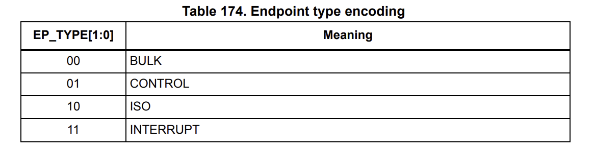

(Bảng RX\*\*)


(Bảng TX\*\*\*)
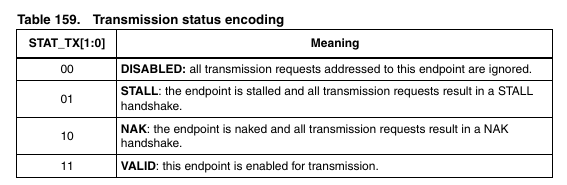

Những state trên thể hiện điều gì? chính là đây
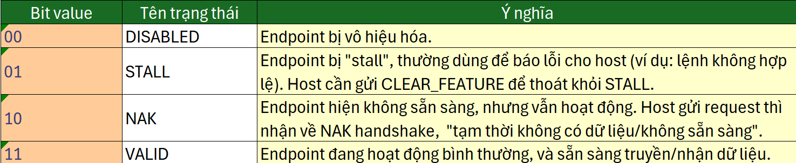

## PHẦN 02: Luồng hoạt động và cách config các function

### Bước 01: Khởi tạo ngắt

```cpp
Bản chất thì USB hoạt động theo cơ chế ngắt (interrupt)
- Khi cắm usb, hoặc có tín hiệu HOST báo tới muốn reset -> khởi tạo lại -> USB_ResetCallBack()
(Check trong thanh ghi ISTR bit RESET)
- Khi bit DIR trong thanh ghi ISTR được set lên, sinh ra một ngắt -> USB_TransactionCallBack()
(This bit is written by the hardware according to the direction of the successful transaction,
which generated the interrupt request.)
```

### Bước 02: USB_ResetCallBack

Mỗi khi reset USB thì function sẽ được call

```cpp
void USB_ResetCallBack(void)
{
    USB->ISTR.BITS.RESET = 0x00;
    //Khởi tạo EP0 khi reset, EP0 dùng để setup & config
    USB_EndpointInit(USB, ENDPOINT_TYPE_CONTROL, 0x80, 0x18, USB_MAX_EP_PACKET_SIZE);
    USB_EndpointInit(USB, ENDPOINT_TYPE_CONTROL, 0x00, 0x58, USB_MAX_EP_PACKET_SIZE);

    USB->DADDR.BITS.EF = 0x01;
    //Mặc định luôn khởi tạo address bằng 0x00, sẽ set sau
    USB->DADDR.BITS.ADD = 0x00;
}
```

### Bước 03: USB_TransactionCallBack

```cpp
void USB_TransactionCallBack(void)
{
    while (USB->ISTR.BITS.CTR != RESET)
    {
        //Lấy ra index của endpoint
        epindex = USB->ISTR.BITS.EP_ID;

        /* Endpoint 0 */
        if (epindex == 0)
        {
            /* DIR = 1 => Out type => CTR_RX bit or both CTR_TX/CTR_RX are set*/
            if (USB->ISTR.BITS.DIR != RESET)
            {
                if (USB->EPnRp[epindex].BITS.SETUP != RESET)
                {
                    // Vô được đây thì chắc chắn là SETUP rồi
                    // 01: Đọc dữ liệu ra: USB_ReadPMA
                    // 02: Clear cờ RX
                    // 03: xử lý quá trình setup
                }
                else
                {
                    //Vô được đây thì chính là out token hay gọi là data out cho thân thuộc
                    if (USB->EPnRp[epindex].BITS.CTR_RX != RESET)
                    {
                        //01: Clear cờ RX
                        //02: Xử lý data nhận được từ host
                    }
                }
            }
            /* DIR = 0 => IN type => CTR_TX bit is set */
            else
            {
                // In token
                if (USB->EPnRp[epindex].BITS.CTR_TX != RESET)
                {
                    // 01: Clear cờ TX
                    // 02: Xử lý quá trình gửi dữ liệu
                }
            }
        }
        else
        {
            /* Endpoint 1, 2, 3... */
            /* DIR = 1 => Out type => CTR_RX bit or both CTR_TX/CTR_RX are set*/
            if (USB->ISTR.BITS.DIR != RESET)
            {
                // Out token
                if (USB->EPnRp[epindex].BITS.CTR_RX != RESET)
                {
                    //01: Clear cờ RX
                    //02: Xử lý data nhận được từ host
                }
            }
            /* DIR = 0 => IN type => CTR_TX bit is set */
            else
            {
                // In token
                if (USB->EPnRp[epindex].BITS.CTR_TX != RESET)
                {
                    // 01: Clear cờ TX
                    // 02: Xử lý quá trình gửi dữ liệu
                }
            }
        }
    }
}
```

Chốt lại là chúng ta cần phải xử lý:

1. Clear các cờ
2. Đọc ghi memory (bản chất là đọc ghi dữ liệu host gửi hoặc mình gửi cho host)
3. Xử lý dữ liệu (bản chất là host sẽ chủ động gửi các bản tin như: setup/out data,.. mình sẽ tùy trường hợp để xử lý bằng việc phản hồi hoặc đọc ra từ host)
   Xử lý xong 3 điều này coi như chúng ta đã đi được 8/10 chặng đường gửi dữ liệu từ device tới host, trong phần sau chúng ta sẽ cùng nhau xử lý các thằng này nhé.

## PHẦN 03: Xử lý lần lượt các tiêu đề

### (1) Clear cờ

```cpp
#define CLEAR_TRANSFER_TX_FLAG(USBx, EP)                            \
     do {                                                           \
         register uint16_t wValReg = 0;                             \
         wValReg = (USBx->EPnRp[EP].WORD & 0x8F8F) & ~(1 << 7);     \
         USBx->EPnRp[EP].WORD = wValReg;                            \
     } while (0)                                                    \

#define CLEAR_TRANSFER_RX_FLAG(USBx, EP)                            \
     do {                                                           \
         register uint16_t wValReg = 0;                             \
         wValReg = (USBx->EPnRp[EP].WORD & 0x8F8F) & ~(1 << 15);    \
         USBx->EPnRp[EP].WORD = wValReg;                            \
     } while (0)
```

### (2) Đọc ghi memory

Đầu tiên chúng ta phải hiểu PMA là gì ?
Packet Memory Area: dùng để lưu dữ liệu truyền/nhận của các endpoint USB, Mỗi địa chỉ byte trong PMA thực chất được ánh xạ 2 byte (16-bit) trên bus 32-bit, và PMA bắt đầu từ địa chỉ base + 0x400 (trên địa chỉ USBx)

Mỗi endpoint (EP) sẽ có 4 thanh ghi 16-bit trong PMA dùng để điều khiển:

```cpp
| STT                          | Chức năng                     |
| ---------------------------- | ----------------------------- |
| 0                            | `ADDR_TX` – địa chỉ TX buffer |
| 1                            | `COUNT_TX` – số byte TX       |
| 2                            | `ADDR_RX` – địa chỉ RX buffer |
| 3                            | `COUNT_RX` – số byte RX       |

```

Về cơ bản những thằng trên là địa chỉ offset của các thanh ghi dữ liệu: chúng được format theo:
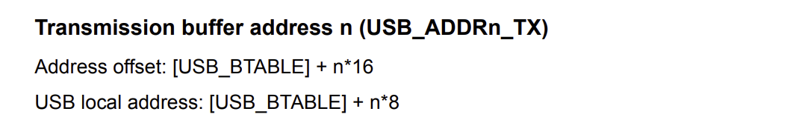
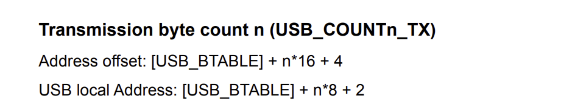
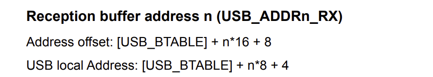
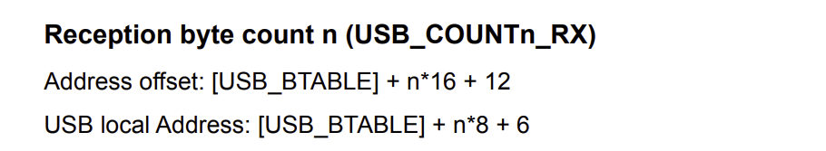
Khi đã có địa chỉ offset rồi thì mình có thể dễ dàng giao tiếp (đọc ghi) vào phân vùng PMA của từng endpoint
✌️ Lưu ý: Memory STM32 ngoại vi là 32 bit tuy nhiên địa chỉ vị trí bộ nhớ thực tế là 16 bit -> cần căn chỉnh
Như doc có ghi
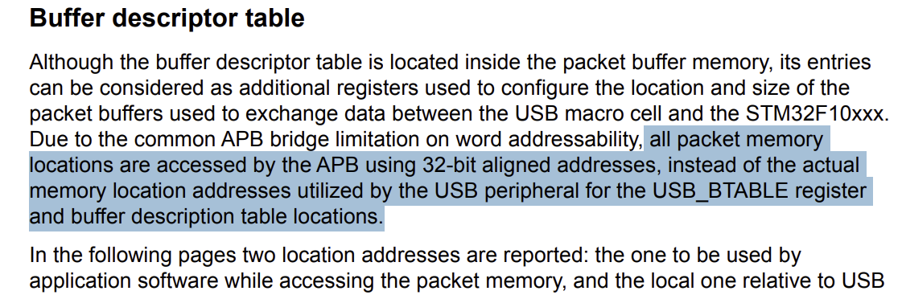
Có thể nhìn thấy rõ hơn tại hình sau
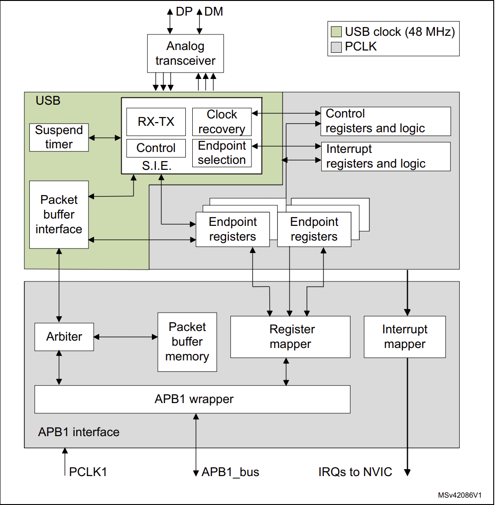

Định nghĩ các function truy câp bộ nhớ PMA

```cpp
// Write Packet Buffer Memory Address
static void USB_WritePMA(USB_Typedef* USBx, uint16_t wBufAddrPMA, uint8_t* buff, uint16_t wCount)
{
    uint32_t index          = 0;
    uint32_t nCount         = (wCount + 1) >> 1;
    uint16_t *pBufAddrAPB   = 0, temp1, temp2;

    pBufAddrAPB = (uint16_t*) (wBufAddrPMA*2 + (uint32_t) USBx + 0x400);

    if (buff == NULL) return;

    for (index = 0; index < nCount; ++index)
    {
        temp1 = (uint16_t) (*buff);
        buff++;
        temp2 = temp1 | (((uint16_t) (*buff)) << 8);
        *pBufAddrAPB = temp2;
        pBufAddrAPB = pBufAddrAPB + 2;
        buff++;
    }
}

// Read Packet Buffer Memory Address
void USB_ReadPMA(USB_Typedef* USBx , uint16_t wBufAddrPMA, uint8_t* buff, uint16_t wCount)
{
    uint32_t index          = 0;
    uint32_t nCount         = (wCount + 1) >> 1;
    uint32_t* pBufAddrAPB   = 0;

    pBufAddrAPB = (uint32_t*) (wBufAddrPMA*2 + (uint32_t) USBx + 0x400);

    for (index = 0; index < nCount; ++index)
    {
        *((uint16_t*) buff) = *((uint16_t*) pBufAddrAPB);
        pBufAddrAPB++;
        buff = buff + 2;
    }
}

```

### (3) Xử lý dữ liệu

Về cơ bản mình sẽ cần viết 2 hàm

```cpp
//Xử lý setup
USB_ProcessSetupStage()
//Xử lý outdata từ host
USB_ProcessDataOutStage()
//Xử lý data từ device -> host
USB_ProcessDataInStage()
```

Host sẽ gửi cho mình một khối dữ liệu có kiểu như sau:

```cpp
typedef struct {
    union
    {
        uint8_t byte;

        struct {
            uint8_t recipient   : 5;    /* 0 = Device
                                           1 = Interface
                                           2 = Endpoint
                                           3 = Other
                                           4...31 = Reserved */

            uint8_t type        : 2;    /* 0 = Standard
                                           1 = Class
                                           2 = Vendor
                                           3 = Reserved */

            uint8_t dir         : 1;    /* 0 = Host-to-device
                                           1 = Device-to-hos */
        } bits;
    } bmRequestType;

    uint8_t     bRequest;
    uint16_t    wValue;
    uint16_t    wIndex;
    uint16_t    wLength;
} USB_RequestTypedef;
```

Hay như hình trong document USB2.0
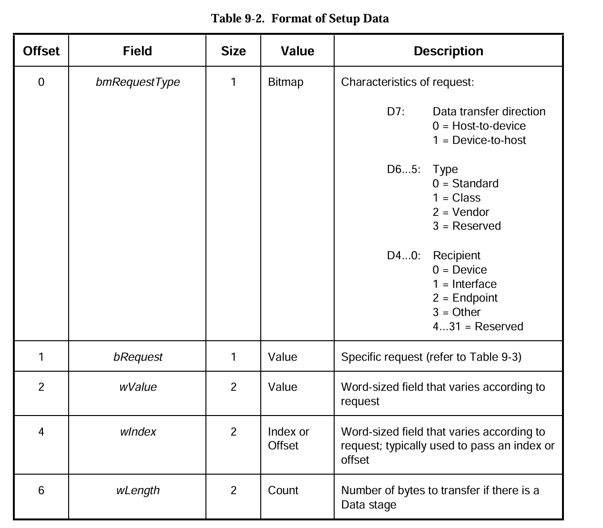

Mình cần define những type cần thiết ra để kiểm tra và phản hồi về cho HOST đúng thứ HOST cần


### \*\* Function USB_ProcessSetupStage()

Hàm setup chúng ta sẽ viết luồng như sau:

```cpp
static void USB_ProcessSetupStage(USB_Typedef* USBx, uint8_t *buff)
{

    if (DevRequest.bmRequestType.bits.type != RESET)
    {
        //Dành cho Class như CDC, HID,..
    }
    else
    {
        // Nếu vào đây thì là Standard
        // Tùy theo HOST cần gì thì mình làm đấy, ghi dữ liệu vào bufftmp
        switch (DevRequest.bRequest)
        {
            case GET_DESCRIPTOR:
            case SET_ADDRESS:
            case GET_CONFIGURATION:
            case SET_CONFIGURATION:
            case CLEAR_FEATURE:
            case SET_FEATURE:
            case GET_INTERFACE:
            case SET_INTERFACE:
            case GET_STATUS:
            case SET_DESCRIPTOR:
            default:
        }
    }

    if ((ControlState & 0x02) != 0x02)         // Next IN Direction
    {

        if ((ControlState & 0x01) != 0x01)      // Next Data Stage
        {
            // Ghi dữ liệu vào để gửi đi
            USB_WritePMA(USBx, USB_ADDR0_TX, bufftmp, USB_COUNT0_TX & 0x3FF);
        }
        //Set các cờ

    }
    else                                        // Next OUT Direction
    {
        //Set các cờ
    }
}
```

### \*\* Function USB_ProcessDataOutStage()

Hàm xử lý dữ liệu truyền về từ host sẽ theo như luồng sau:

```cpp
static void USB_ProcessDataOutStage(USB_Typedef* USBx, uint8_t ep)
{
    uint8_t  i;
    uint16_t wLength;

    if (ep == 0)
    {
        // Vào đây thì là EP0
        if ((ControlState & 0x01) != 0x01)          /* Data Stage */
        {
            // Nhận dữ liệu
            // Set các cờ
        }
        else                                        /* Status Stage */
        {
            // Set các cờ
        }
    }
    else
    {
        // Vào đây thì là EP 1, 2, 3...
        if ((ControlState & 0x04) != 0x04)
        {
            // Nhận dữ liệu
            // Set các cờ
        }
    }
}
```

### \*\* Function USB_ProcessDataInStage()

Hàm xử lý dữ liệu từ device -> HOST

```cpp
static void USB_ProcessDataInStage(USB_Typedef* USBx, uint8_t ep)
{
    if ((ControlState & 0x01) != 0x01)          /* Data Stage */
    {
        if (bCount > GetMaxPacketOutEP(ep))
        {
            // Vào đây là size gửi > max
            // Set các cờ
            // Ghi dữ liệu
        }
        else
        {
            // Vào đây là size gửi < max
            ControlState = ControlState & ~0x08;

            if ((ControlState & 0x40) == 0x40)
            {
                // Set các cờ
                // Ghi dữ liệu
                USB_WritePMA(USBx, USB_ADDR_TX(ep), bufftmp, USB_COUNT_TX(ep) & 0x3FF);
            }
            else
            {
                /* Next Status Stage and OUT direction */
                // Set các cờ
            }
        }
    }
    else                                        /* Status Stage */
    {
        // Set các cờ
    }
}
```

## Chương 14 Linker

```text
Học trong slide
```

```cpp
ENTRY(Reset_Handler)

MEMORY
{
    FLASH(rx):ORIGIN =0x08000000, LENGTH = 128K
    SRAM(rwx):ORIGIN =0x20000000, LENGTH = 20K
}

SECTIONS
{
    .text :
    {
        *(.isr_vector)
        *(.text*)
        *(.rodata*)
        . = ALIGN(4);
        _etext = .;
    } > FLASH

    .data :
    {
        _sdata = .;
        *(.data*)
        . = ALIGN(4);
        _edata = .;
    } > SRAM AT > FLASH

    .bss :
    {
        _sbss = .;
        *(.bss*)
        . = ALIGN(4);
        _ebss = .;
    } > SRAM
}

```

## Chương 15 Startup

```text
Học trong slide
```

```cpp
#include <stdint.h>

#define SRAM_START 0x20000000
#define SRAM_SIZE (20U * 1024)
#define SRAM_END (SRAM_START + SRAM_SIZE)

#define STACK_START SRAM_END

extern uint32_t _etext;
extern uint32_t _sdata;
extern uint32_t _edata;
extern uint32_t _sbss;
extern uint32_t _ebss;

void main();

void Reset_Handler(void);

void NMI_Handler(void) __attribute__((weak, alias("Default_Handler")));
void HardFault_Handler(void) __attribute__((weak, alias("Default_Handler")));
void MemManage_Handler(void) __attribute__((weak, alias("Default_Handler")));
void BusFault_Handler(void) __attribute__((weak, alias("Default_Handler")));
void UsageFault_Handler(void) __attribute__((weak, alias("Default_Handler")));
void SVC_Handler(void) __attribute__((weak, alias("Default_Handler")));
void DebugMon_Handler(void) __attribute__((weak, alias("Default_Handler")));
void PendSV_Handler(void) __attribute__((weak, alias("Default_Handler")));
void SysTick_Handler(void) __attribute__((weak, alias("Default_Handler")));
void WWDG_IRQHandler(void) __attribute__((weak, alias("Default_Handler")));
void PVD_IRQHandler(void) __attribute__((weak, alias("Default_Handler")));
void TAMP_STAMP_IRQHandler(void) __attribute__((weak, alias("Default_Handler")));
void RTC_WKUP_IRQHandler(void) __attribute__((weak, alias("Default_Handler")));
void RCC_IRQHandler(void) __attribute__((weak, alias("Default_Handler")));
void EXTI0_IRQHandler(void) __attribute__((weak, alias("Default_Handler")));
void EXTI1_IRQHandler(void) __attribute__((weak, alias("Default_Handler")));
void EXTI2_IRQHandler(void) __attribute__((weak, alias("Default_Handler")));
void EXTI3_IRQHandler(void) __attribute__((weak, alias("Default_Handler")));
void EXTI4_IRQHandler(void) __attribute__((weak, alias("Default_Handler")));
void DMA1_Stream0_IRQHandler(void) __attribute__((weak, alias("Default_Handler")));
void DMA1_Stream1_IRQHandler(void) __attribute__((weak, alias("Default_Handler")));
void DMA1_Stream2_IRQHandler(void) __attribute__((weak, alias("Default_Handler")));
void DMA1_Stream3_IRQHandler(void) __attribute__((weak, alias("Default_Handler")));
void DMA1_Stream4_IRQHandler(void) __attribute__((weak, alias("Default_Handler")));
void DMA1_Stream5_IRQHandler(void) __attribute__((weak, alias("Default_Handler")));
void DMA1_Stream6_IRQHandler(void) __attribute__((weak, alias("Default_Handler")));
void ADC_IRQHandler(void) __attribute__((weak, alias("Default_Handler")));
void CAN1_TX_IRQHandler(void) __attribute__((weak, alias("Default_Handler")));
void CAN1_RX0_IRQHandler(void) __attribute__((weak, alias("Default_Handler")));
void CAN1_RX1_IRQHandler(void) __attribute__((weak, alias("Default_Handler")));
void CAN1_SCE_IRQHandler(void) __attribute__((weak, alias("Default_Handler")));
void EXTI9_5_IRQHandler(void) __attribute__((weak, alias("Default_Handler")));
void TIM1_BRK_TIM9_IRQHandler(void) __attribute__((weak, alias("Default_Handler")));
void TIM1_UP_TIM10_IRQHandler(void) __attribute__((weak, alias("Default_Handler")));
void TIM1_TRG_COM_TIM11_IRQHandler(void) __attribute__((weak, alias("Default_Handler")));
void TIM1_CC_IRQHandler(void) __attribute__((weak, alias("Default_Handler")));
void TIM2_IRQHandler(void) __attribute__((weak, alias("Default_Handler")));
void TIM3_IRQHandler(void) __attribute__((weak, alias("Default_Handler")));
void TIM4_IRQHandler(void) __attribute__((weak, alias("Default_Handler")));
void I2C1_EV_IRQHandler(void) __attribute__((weak, alias("Default_Handler")));
void I2C1_ER_IRQHandler(void) __attribute__((weak, alias("Default_Handler")));
void I2C2_EV_IRQHandler(void) __attribute__((weak, alias("Default_Handler")));
void I2C2_ER_IRQHandler(void) __attribute__((weak, alias("Default_Handler")));
void SPI1_IRQHandler(void) __attribute__((weak, alias("Default_Handler")));
void SPI2_IRQHandler(void) __attribute__((weak, alias("Default_Handler")));
void USART1_IRQHandler(void) __attribute__((weak, alias("Default_Handler")));
void USART2_IRQHandler(void) __attribute__((weak, alias("Default_Handler")));
void USART3_IRQHandler(void) __attribute__((weak, alias("Default_Handler")));
void EXTI15_10_IRQHandler(void) __attribute__((weak, alias("Default_Handler")));
void RTC_Alarm_IRQHandler(void) __attribute__((weak, alias("Default_Handler")));
void OTG_FS_WKUP_IRQHandler(void) __attribute__((weak, alias("Default_Handler")));
void TIM8_BRK_TIM12_IRQHandler(void) __attribute__((weak, alias("Default_Handler")));
void TIM8_UP_TIM13_IRQHandler(void) __attribute__((weak, alias("Default_Handler")));
void TIM8_TRG_COM_TIM14_IRQHandler(void) __attribute__((weak, alias("Default_Handler")));
void TIM8_CC_IRQHandler(void) __attribute__((weak, alias("Default_Handler")));
void DMA1_Stream7_IRQHandler(void) __attribute__((weak, alias("Default_Handler")));
void FSMC_IRQHandler(void) __attribute__((weak, alias("Default_Handler")));
void SDIO_IRQHandler(void) __attribute__((weak, alias("Default_Handler")));
void TIM5_IRQHandler(void) __attribute__((weak, alias("Default_Handler")));
void SPI3_IRQHandler(void) __attribute__((weak, alias("Default_Handler")));
void UART4_IRQHandler(void) __attribute__((weak, alias("Default_Handler")));
void UART5_IRQHandler(void) __attribute__((weak, alias("Default_Handler")));
void TIM6_DAC_IRQHandler(void) __attribute__((weak, alias("Default_Handler")));
void TIM7_IRQHandler(void) __attribute__((weak, alias("Default_Handler")));
void DMA2_Stream0_IRQHandler(void) __attribute__((weak, alias("Default_Handler")));
void DMA2_Stream1_IRQHandler(void) __attribute__((weak, alias("Default_Handler")));
void DMA2_Stream2_IRQHandler(void) __attribute__((weak, alias("Default_Handler")));
void DMA2_Stream3_IRQHandler(void) __attribute__((weak, alias("Default_Handler")));
void DMA2_Stream4_IRQHandler(void) __attribute__((weak, alias("Default_Handler")));
void ETH_IRQHandler(void) __attribute__((weak, alias("Default_Handler")));
void ETH_WKUP_IRQHandler(void) __attribute__((weak, alias("Default_Handler")));
void CAN2_TX_IRQHandler(void) __attribute__((weak, alias("Default_Handler")));
void CAN2_RX0_IRQHandler(void) __attribute__((weak, alias("Default_Handler")));
void CAN2_RX1_IRQHandler(void) __attribute__((weak, alias("Default_Handler")));
void CAN2_SCE_IRQHandler(void) __attribute__((weak, alias("Default_Handler")));
void OTG_FS_IRQHandler(void) __attribute__((weak, alias("Default_Handler")));
void DMA2_Stream5_IRQHandler(void) __attribute__((weak, alias("Default_Handler")));
void DMA2_Stream6_IRQHandler(void) __attribute__((weak, alias("Default_Handler")));
void DMA2_Stream7_IRQHandler(void) __attribute__((weak, alias("Default_Handler")));
void USART6_IRQHandler(void) __attribute__((weak, alias("Default_Handler")));
void I2C3_EV_IRQHandler(void) __attribute__((weak, alias("Default_Handler")));
void I2C3_ER_IRQHandler(void) __attribute__((weak, alias("Default_Handler")));
void OTG_HS_EP1_OUT_IRQHandler(void) __attribute__((weak, alias("Default_Handler")));
void OTG_HS_EP1_IN_IRQHandler(void) __attribute__((weak, alias("Default_Handler")));
void OTG_HS_WKUP_IRQHandler(void) __attribute__((weak, alias("Default_Handler")));
void OTG_HS_IRQHandler(void) __attribute__((weak, alias("Default_Handler")));
void DCMI_IRQHandler(void) __attribute__((weak, alias("Default_Handler")));
void CRYP_IRQHandler(void) __attribute__((weak, alias("Default_Handler")));
void HASH_RNG_IRQHandler(void) __attribute__((weak, alias("Default_Handler")));
void FPU_IRQHandler(void) __attribute__((weak, alias("Default_Handler")));

uint32_t vectors[] __attribute__((section(".isr_vector"))) = {
    STACK_START,
    (uint32_t)Reset_Handler,
    (uint32_t)NMI_Handler,
    (uint32_t)HardFault_Handler,
    (uint32_t)MemManage_Handler,
    (uint32_t)BusFault_Handler,
    (uint32_t)UsageFault_Handler,
    0,
    0,
    0,
    0,
    (uint32_t)SVC_Handler,
    (uint32_t)DebugMon_Handler,
    0,
    (uint32_t)PendSV_Handler,
    (uint32_t)SysTick_Handler,
    (uint32_t)WWDG_IRQHandler,
    (uint32_t)PVD_IRQHandler,
    (uint32_t)TAMP_STAMP_IRQHandler,
    (uint32_t)RTC_WKUP_IRQHandler,
    0,
    (uint32_t)RCC_IRQHandler,
    (uint32_t)EXTI0_IRQHandler,
    (uint32_t)EXTI1_IRQHandler,
    (uint32_t)EXTI2_IRQHandler,
    (uint32_t)EXTI3_IRQHandler,
    (uint32_t)EXTI4_IRQHandler,
    (uint32_t)DMA1_Stream0_IRQHandler,
    (uint32_t)DMA1_Stream1_IRQHandler,
    (uint32_t)DMA1_Stream2_IRQHandler,
    (uint32_t)DMA1_Stream3_IRQHandler,
    (uint32_t)DMA1_Stream4_IRQHandler,
    (uint32_t)DMA1_Stream5_IRQHandler,
    (uint32_t)DMA1_Stream6_IRQHandler,
    (uint32_t)ADC_IRQHandler,
    (uint32_t)CAN1_TX_IRQHandler,
    (uint32_t)CAN1_RX0_IRQHandler,
    (uint32_t)CAN1_RX1_IRQHandler,
    (uint32_t)CAN1_SCE_IRQHandler,
    (uint32_t)EXTI9_5_IRQHandler,
    (uint32_t)TIM1_BRK_TIM9_IRQHandler,
    (uint32_t)TIM1_UP_TIM10_IRQHandler,
    (uint32_t)TIM1_TRG_COM_TIM11_IRQHandler,
    (uint32_t)TIM1_CC_IRQHandler,
    (uint32_t)TIM2_IRQHandler,
    (uint32_t)TIM3_IRQHandler,
    (uint32_t)TIM4_IRQHandler,
    (uint32_t)I2C1_EV_IRQHandler,
    (uint32_t)I2C1_ER_IRQHandler,
    (uint32_t)I2C2_EV_IRQHandler,
    (uint32_t)I2C2_ER_IRQHandler,
    (uint32_t)SPI1_IRQHandler,
    (uint32_t)SPI2_IRQHandler,
    (uint32_t)USART1_IRQHandler,
    (uint32_t)USART2_IRQHandler,
    (uint32_t)USART3_IRQHandler,
    (uint32_t)EXTI15_10_IRQHandler,
    (uint32_t)RTC_Alarm_IRQHandler,
    (uint32_t)OTG_FS_WKUP_IRQHandler,
    (uint32_t)TIM8_BRK_TIM12_IRQHandler,
    (uint32_t)TIM8_UP_TIM13_IRQHandler,
    (uint32_t)TIM8_TRG_COM_TIM14_IRQHandler,
    (uint32_t)TIM8_CC_IRQHandler,
    (uint32_t)DMA1_Stream7_IRQHandler,
    (uint32_t)FSMC_IRQHandler,
    (uint32_t)SDIO_IRQHandler,
    (uint32_t)TIM5_IRQHandler,
    (uint32_t)SPI3_IRQHandler,
    (uint32_t)UART4_IRQHandler,
    (uint32_t)UART5_IRQHandler,
    (uint32_t)TIM6_DAC_IRQHandler,
    (uint32_t)TIM7_IRQHandler,
    (uint32_t)DMA2_Stream0_IRQHandler,
    (uint32_t)DMA2_Stream1_IRQHandler,
    (uint32_t)DMA2_Stream2_IRQHandler,
    (uint32_t)DMA2_Stream3_IRQHandler,
    (uint32_t)DMA2_Stream4_IRQHandler,
    (uint32_t)ETH_IRQHandler,
    (uint32_t)ETH_WKUP_IRQHandler,
    (uint32_t)CAN2_TX_IRQHandler,
    (uint32_t)CAN2_RX0_IRQHandler,
    (uint32_t)CAN2_RX1_IRQHandler,
    (uint32_t)CAN2_SCE_IRQHandler,
    (uint32_t)OTG_FS_IRQHandler,
    (uint32_t)DMA2_Stream5_IRQHandler,
    (uint32_t)DMA2_Stream6_IRQHandler,
    (uint32_t)DMA2_Stream7_IRQHandler,
    (uint32_t)USART6_IRQHandler,
    (uint32_t)I2C3_EV_IRQHandler,
    (uint32_t)I2C3_ER_IRQHandler,
    (uint32_t)OTG_HS_EP1_OUT_IRQHandler,
    (uint32_t)OTG_HS_EP1_IN_IRQHandler,
    (uint32_t)OTG_HS_WKUP_IRQHandler,
    (uint32_t)OTG_HS_IRQHandler,
    (uint32_t)DCMI_IRQHandler,
    (uint32_t)CRYP_IRQHandler,
    (uint32_t)HASH_RNG_IRQHandler,
    (uint32_t)FPU_IRQHandler,
};

void Reset_Handler()
{
    uint32_t size = (uint32_t)&_edata - (uint32_t)&_sdata;
    uint8_t *pDst = (uint8_t *)&_sdata;
    uint8_t *pSrc = (uint8_t *)&_etext;
    for (uint32_t i = 0; i < size; i++)
    {
        *pDst++ = *pSrc++;
    }
    // Init .bss section to zero in SRAM
    size = (uint32_t)&_ebss - (uint32_t)&_sbss;
    pDst = (uint8_t *)_sbss;
    for (uint32_t i = 0; i < size; i++)
    {
        *pDst++ = 0x00;
    }
    main();
}

void Default_Handler()
{
    while (1)
    {
    }
}

```

## Chương 16 MakeFile

```text
Học trong slide
```

```text
B1 Cài đặt makeFile: xem trong seri makeFile
    Link: Youtube-> Seri MakeFile
B2 Cài đặt toolchanin
    Link: https://developer.arm.com/downloads/-/gnu-rm
```

```py
GCC_DIR   :=  C:/Toolchain/Arm_Toolchain
OBJ_COPY  := $(GCC_DIR)/bin/arm-none-eabi-objcopy
CC     := $(GCC_DIR)/bin/arm-none-eabi-gcc
OUTPUT_DIR := ./Output
LINKER_DIR := ./Linker
# Include files
INC_DIRS  := ./Driver/Inc
INC_FILES   := $(foreach INC_DIR, $(INC_DIRS), $(wildcard $(INC_DIR)/*))

# Source files
SRC_DIRS := ./Driver/Src ./Core ./Startup
SRC_FILES   := $(foreach SRC_DIR, $(SRC_DIRS), $(wildcard $(SRC_DIR)/*))

# Object files
OBJ_FILES := $(patsubst %.c, %.o, $(notdir $(SRC_FILES)))
OBJ_PATHS := $(foreach OBJ_FILE, $(OBJ_FILES), $(OUTPUT_DIR)/$(OBJ_FILE))

# CC option for INC_DIRS
INC_DIRS_OPT:= $(foreach INC_DIR, $(INC_DIRS), -I$(INC_DIR))

# Compiler options
CHIP   := cortex-m3
CCFLAGS  := -c -mcpu=$(CHIP) -mthumb -std=gnu11 -O0 $(INC_DIRS_OPT)

# Linker options
LDFLAGS  := -nostdlib -T $(LINKER_DIR)/stm_ls.ld -Wl,-Map=Output/makefile.map

vpath %.c $(SRC_DIRS)

build: makefile.hex

print-%:
 @echo $($(subst print-,,$@))

clean:
 rm -f Output/*

%.o:%.c
 $(CC) $(CCFLAGS) -o $(OUTPUT_DIR)/$@ $^

makefile.elf:$(OBJ_FILES)
 $(CC) $(LDFLAGS) -o $(OUTPUT_DIR)/$@ $(OBJ_PATHS)

makefile.hex:makefile.elf
 $(OBJ_COPY) -O ihex $(OUTPUT_DIR)/$^ $(OUTPUT_DIR)/$@
```

## TÀI LIỆU THAM KHẢO

------- STM32 RM -----------
<https://www.st.com/resource/en/reference_manual/rm0008-stm32f101xx-stm32f102xx-stm32f103xx-stm32f105xx-and-stm32f107xx-advanced-armbased-32bit-mcus-stmicroelectronics.pdf>
---- STM32 Datasheet -----
<https://www.st.com/resource/en/datasheet/stm32f103c8.pdf>
---- Tài liệu usb 2.0 ---------
<https://www.usb.org/document-library/usb-20-specification>
<https://lazytrick.wordpress.com/2016/03/21/usb-cho-dev-chap-03-giao-thuc/>
<https://www.beyondlogic.org/usbnutshell/usb3.shtml>
